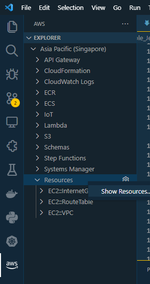
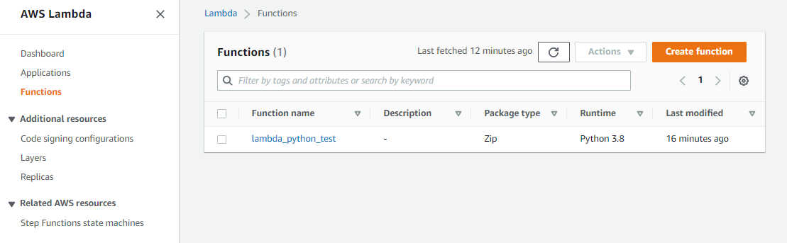
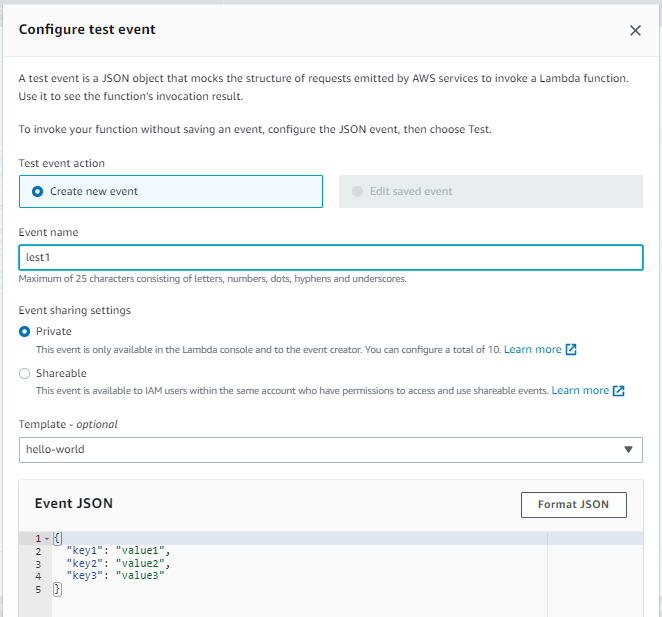
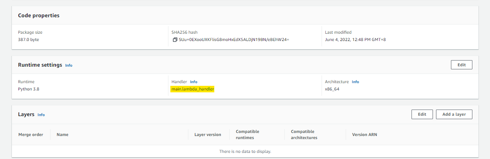
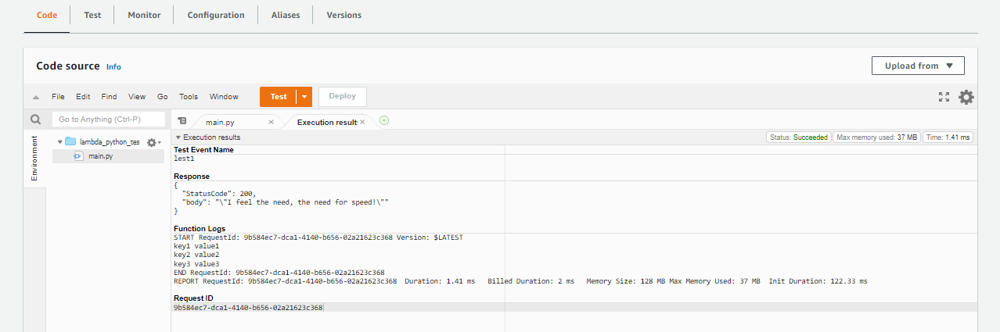
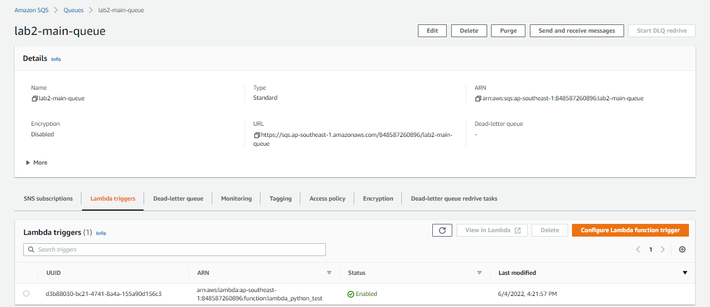
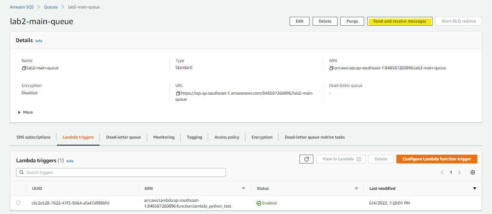
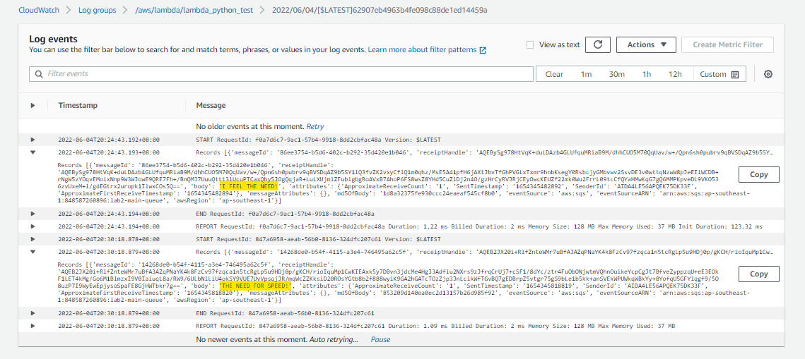

# Lab 002: DEV Environment with SQS and Lambda


- [Introduction](#introduction)
- [Pre-requisites](#pre-requisites)
- [Lambda function](#lambda-function)
- [Create the Provider file](#create-the-provider-file)
- [Create the Variables file](#create-the-variables-file)
- [Create the main.tf file and run](#create-the-maintf-file-and-run)
- [Test the Lambda function](#test-the-lambda-function)
- [Modify the Lambda Handler Name](#modify-the-lambda-handler-name)
- [Create the SQS Queues](#create-the-sqs-queues)
- [Attach SQS Permissions to the IAM Role for Lambda](#attach-sqs-permissions-to-the-iam-role-for-lambda)
- [Link the SQS Queues and Lambda Function](#link-the-sqs-queues-and-lambda-function)
- [Configure Logging to CloudWatch](#configure-logging-to-cloudwatch)
- [Testing our Setup](#testing-our-setup)
- [Cleanup](#cleanup)
- [Resources](#resources)


## Introduction

In this lab:

1. We have an SQS main queue that will feed messages to a Lambda function that's written in Python.
2. The Lambda function will have 2 attempts to process the messages.
3. After two failed attempts, the function will send the message to a secondary queue, which is called a **Dead Letter Queue**.

Local environment used for this lab. 

- Windows machine/laptop
- Visual Studio Code v1.67.2 (VSCode)
- WSL on Visual Studio Code
- Amazon Web Services (AWS) resources
            
## Pre-requisites 

- [Setup Keys and Permissions](../README.md#pre-requisites)
- [Setup your Local Environment and Install Extensions](../README.md#pre-requisites) 
- [Configure the Credentials File](../README.md#pre-requisites) 
- [Install Terraform](../README.md#pre-requisites) 

## Lambda function

Here is the Lambda function that we'll be using.
 
```python

# main.py
#-----------------------------
# Lambda function that processes data from an SQS queue.
# After two failed attempts, functino sends message to a dead letter queue.
#-----------------------------

import json

def lambda_handler(event, context):
  for k, v in event.items():
    print(k, v)

  return {
    'StatusCode': 200,
    'body': json.dumps('I feel the need, the need for speed!')
  }
```


## Create the Provider file

From the [Hashicorp's documentation](https://registry.terraform.io/providers/hashicorp/aws/latest/docs):

<small> Use the Amazon Web Services (AWS) provider to interact with the many resources supported by AWS. You must configure the provider with the proper credentials before you can use it. </small>

Let's start with creating the **provider.tf**
 
```bash
### provider.tf
terraform {
  required_version = ">= 0.12"
  required_providers {
    aws = {
      source  = "hashicorp/aws"
      version = ">= 4.16.0"
    }
  }
}

provider "aws" {
  region                   = var.aws_region
  shared_credentials_files = var.my_credentials
  profile                  = var.my_profile
}
```

## Create the Variables file

The variables file will contain all the variables that you'll use on your main template file.

```bash
### variables.tf 
variable "aws_region" {
  description = "AWS region"
  type        = string
    default     = "ap-southeast-1"
}

variable "my_credentials" {
  description = "Credentials to be used to connect to AWS"
  type        = list(string)
    default     = ["/mnt/c/Users/Eden.Jose/.aws/credentials"]
}

variable "my_profile" {
  description = "Profile to be used to connect to AWS"
  type        = string
    default     = "vscode-dev"
}  
```
</details>
<br>

Note that there's also a precedence of the variables. 

- **.tfvars** files are used first
- If there are no **tfvars** file, the **variables.tf** is used 
 that exists. 
 
Create a default **terraform.tfvars** file.

```bash
### terraform.tfvars
aws_region     = "ap-southeast-1"
my_credentials = ["/mnt/c/Users/Eden.Jose/.aws/credentials"]
my_profile     = "vscode-dev" 
```

## Create the main.tf file and run

After we've configured the variables and provider file, the next step is to create the **main.tf** which will contain all the resources we'll provision.

 
```bash
### main.tf 
# Creates a zip file of the main.py function
data "archive_file" "tfzip" {
  type        = "zip"
  source_file = "main.py"
  output_path = "main.zip"
}

# Creates lambda function
resource "aws_lambda_function" "lambda_python_test" {
  filename      = "main.zip"
  function_name = "lambda_python_test"
  role          = aws_iam_role.lambda_python_test_iam_role.arn
  handler       = "lambda_handler"
  runtime       = "python3.8"
  source_code_hash = data.archive_file.lambda_python_test.output_base64sha256
}

# Creates lambda iam role
resource "aws_iam_role" "lambda_python_test_iam_role" {
  name = "lambda_python_test_iam_role"

  assume_role_policy = <<EOF
{
  "Version": "2012-10-17",
  "Statement": [
    {
      "Action": "sts:AssumeRole",
      "Principal": {
        "Service": "lambda.amazonaws.com"
      },
      "Effect": "Allow",
      "Sid": ""
    }
  ]
}
EOF
}
```

Then, initialize the working directory. 

```bash
terraform init 
```

Review.

```bash
terraform plan 
```

If the command above didn't return any error, you can now run it. This will prompt you to confirm the changes you want to make.

```bash
terraform apply 
```

You can also set it to automatically approve the changes by running the command below.

```bash
terraform apply -auto-approve 
```

It should return this message if there's no error.

```bash
Apply complete! Resources: 2 added, 0 changed, 0 destroyed. 
```

To verify, click the AWS extension on the left panel in your VSCode. It should open an Explorer tab.

```bash
Right-click on Resources --> Show Resources --> AWS::Lambda::Function --> OK
```

  
  
  

Click the function name. It should open a JSON file.

```bash
{
    "MemorySize": 128,
    "Description": "",
    "TracingConfig": {
        "Mode": "PassThrough"
    },
    "Timeout": 3,
    "Handler": "lambda_handler",
    "Role": "arn:aws:iam::848587260896:role/lambda_python_test_iam_role",
    "FileSystemConfigs": [],
    "FunctionName": "lambda_python_test",
    "Runtime": "python3.8",
    "PackageType": "Zip",
    "Arn": "arn:aws:lambda:ap-southeast-1:848587260896:function:lambda_python_test",
    "EphemeralStorage": {
        "Size": 512
    },
    "Architectures": [
        "x86_64"
    ]
} 
```

Similarly, you can also check on the AWS Console and go to Lambda. Click the function to see its configuration.

  
  


## Test the Lambda function

Scroll down to the **Code** section at the bottom and double-click **main.py** to see the code. It's time to test it.

  

```bash
Dropdown "Test" --> Configure test event 
```

In the **Configure test event** prompt, name the test "test1". Keep the default settings for the rest and hit **Save** at the bottom.

  

Back in the **Code source** section, click **Test**. You'll see that it returns an error message. Lambda is actually complaining because it's not able to find the "lambda handler" file, which we actually named **main.py**.

  


## Modify the Lambda Handler Name

To solve the error, we can edit the main.tf and change the **handler** value under the **aws_lambda_function** resource to "main.lambda_handler".

```bash
### main.py
# Creates a zip file of the main.py function
data "archive_file" "tfzip" {
  type        = "zip"
  source_file = "main.py"
  output_path = "main.zip"
}

# Creates lambda function
resource "aws_lambda_function" "lambda_python_test" {
  filename         = "main.zip"
  function_name    = "lambda_python_test"
  role             = aws_iam_role.lambda_python_test_iam_role.arn
  handler          = "main.lambda_handler"
  runtime          = "python3.8"
  source_code_hash = filebase64sha256("main.zip")
}

# Creates lambda iam role
resource "aws_iam_role" "lambda_python_test_iam_role" {
  name = "lambda_python_test_iam_role"

  assume_role_policy = <<EOF
{
  "Version": "2012-10-17",
  "Statement": [
    {
      "Action": "sts:AssumeRole",
      "Principal": {
        "Service": "lambda.amazonaws.com"
      },
      "Effect": "Allow",
      "Sid": ""
    }
  ]
}
EOF
}
```
 

Review. If it doesn't return any error message, apply.

```bash
terraform plan  
```
```bash
terraform apply -auto-approve
```

Going back to the AWS Console, refresh the page and scroll down to the **Runtime settings** section. You should now see the new Handler name.

  

On the **Code source** section, hit test again. A StatusCode of 200, along with the message should appear.

  


## Create the SQS Queues

Recall that we'll be creating two SQS queues:

- main queue
- dead letter queue

Edit the main.tf to include the resource **aws_sqs_queue**.

```bash
### main.tf 
# Creates a zip file of the main.py function
data "archive_file" "tfzip" {
  type        = "zip"
  source_file = "main.py"
  output_path = "main.zip"
}

# Creates lambda function
resource "aws_lambda_function" "lambda_python_test" {
  filename         = "main.zip"
  function_name    = "lambda_python_test"
  role             = aws_iam_role.lambda_python_test_iam_role.arn
  handler          = "main.lambda_handler"
  runtime          = "python3.8"
  source_code_hash = filebase64sha256("main.zip")
}

# Creates lambda IAM role
resource "aws_iam_role" "lambda_python_test_iam_role" {
  name = "lambda_python_test_iam_role"

  assume_role_policy = <<EOF
{
  "Version": "2012-10-17",
  "Statement": [
    {
      "Action": "sts:AssumeRole", 
      "Principal": {
        "Service": "lambda.amazonaws.com"
      },
      "Effect": "Allow",
      "Sid": ""
    }
  ]
}
EOF
}

# Create SQS-Main queue
resource "aws_sqs_queue" "lab2-main-queue" {
  name                      = "lab2-main-queue"
  delay_seconds             = 90
  max_message_size          = 2048
  message_retention_seconds = 86400
  receive_wait_time_seconds = 10
}

# Create SQS-dead letter queue
resource "aws_sqs_queue" "lab2-dlq-queue" {
  name                      = "lab2-dlq-queue"
  delay_seconds             = 90
  max_message_size          = 2048
  message_retention_seconds = 86400
  receive_wait_time_seconds = 10
}
```
 
Review. If it doesn't return any error message, apply.

```bash
terraform plan  
```
```bash
terraform apply -auto-approve
```

Verify if the two SQS queues are created through the AWS Console by going to the SQS menu.

  


## Attach SQS Permissions to the IAM Role for Lambda

So far, we've created the execution role for Lambda. However, this role doesn't have the necessary permissions for SQS, namely:

- sqs:ReceiveMessage
- sqs:DeleteMessage
- sqs:GetQueueAttributes

As such, we need to do the following steps:

- Create the policy document
- Create the actual IAM role policy from the policy document
- Attach the IAM role policy to the IAM role

You may read more about the policy and policy attachments in the link below:

- [Data Source: aws_iam_policy_document](https://registry.terraform.io/providers/hashicorp/aws/latest/docs/data-sources/iam_policy_document)
- [Resource: aws_iam_role_policy_attachment](https://registry.terraform.io/providers/hashicorp/aws/latest/docs/resources/iam_role_policy_attachment)
- [Lambda service throws error execution role does not have permissions to call receiveMessage on SQS](https://stackoverflow.com/questions/55472987/lambda-service-throws-error-execution-role-does-not-have-permissions-to-call-rec)

Modify the main.tf file.

```bash
### main.tf 
# Creates a zip file of the main.py function
data "archive_file" "tfzip" {
  type        = "zip"
  source_file = "main.py"
  output_path = "main.zip"
}

# Creates lambda function
resource "aws_lambda_function" "lambda_python_test" {
  filename         = "main.zip"
  function_name    = "lambda_python_test"
  role             = aws_iam_role.lambda_python_test_iam_role.arn
  handler          = "main.lambda_handler"
  runtime          = "python3.8"
  source_code_hash = filebase64sha256("main.zip")
}

# Creates lambda IAM role
resource "aws_iam_role" "lambda_python_test_iam_role" {
  name = "lambda_python_test_iam_role"

  assume_role_policy = <<EOF
{
  "Version": "2012-10-17",
  "Statement": [
    {
      "Action": "sts:AssumeRole", 
      "Principal": {
        "Service": "lambda.amazonaws.com"
      },
      "Effect": "Allow",
      "Sid": ""
    }
  ]
}
EOF
}

# Create SQS-Main queue
resource "aws_sqs_queue" "lab2-main-queue" {
  name                      = "lab2-main-queue"
  delay_seconds             = 90
  max_message_size          = 2048
  message_retention_seconds = 86400
  receive_wait_time_seconds = 10
}

# Create SQS-dead letter queue
resource "aws_sqs_queue" "lab2-dlq-queue" {
  name                      = "lab2-dlq-queue"
  delay_seconds             = 90
  max_message_size          = 2048
  message_retention_seconds = 86400
  receive_wait_time_seconds = 10
}

# Create the policy document which will contain the actions for accessing the SQS main queue.
data "aws_iam_policy_document" "sqs-policy-doc" {
  statement {
    sid = "1"
    actions = [
      "sqs:ReceiveMessage",
      "sqs:DeleteMessage",
      "sqs:GetQueueAttributes"
    ]
    resources = [
      aws_sqs_queue.lab2-main-queue.arn
    ]
  }
}

# Creates the policy from the policy document.
resource "aws_iam_policy" "sqs-policy" {
  name   = "sqs-policy"
  policy = data.aws_iam_policy_document.sqs-policy-doc.json
}

# Attaches the policy to the IAM role
resource "aws_iam_role_policy_attachment" "sqs-policy-attach" {
  role       = aws_iam_role.lambda_python_test_iam_role.name
  policy_arn = aws_iam_policy.sqs-policy.arn
}
```
 
We'll just do a review for this step. We'll apply the changes once we've linked the SQS main queue and Lambda function.

```bash
terraform plan 
```

## Link the SQS Queues and Lambda Function

Now that we've create the SQS Queues and the Lambda function, and we've created and attached the necessary policies, the next step is establish the link between the two services. To do this, we will use the resource **aws_lambda_event_source_mapping**.

From the Hashicorp documentation on [aws_lambda_event_source_mapping:](https://registry.terraform.io/providers/hashicorp/aws/latest/docs/resources/lambda_event_source_mapping)

<small>This allows Lambda functions to get events from Kinesis, DynamoDB, SQS, Amazon MQ and Managed Streaming for Apache Kafka (MSK).</small>

Edit the main.tf to add the new resource.

```bash
### main.tf 
# This terraform template deploys a main SQS queue which will 
# trigger a Lambda function.
#----------------

# Creates a zip file of the main.py function.
data "archive_file" "tfzip" {
  type        = "zip"
  source_file = "main.py"
  output_path = "main.zip"
}

# Creates lambda function
resource "aws_lambda_function" "lambda_python_test" {
  filename         = "main.zip"
  function_name    = "lambda_python_test"
  role             = aws_iam_role.lambda_python_test_iam_role.arn
  handler          = "main.lambda_handler"
  runtime          = "python3.8"
  source_code_hash = filebase64sha256("main.zip")
}

# Creates lambda IAM role.
resource "aws_iam_role" "lambda_python_test_iam_role" {
  name = "lambda_python_test_iam_role"

  assume_role_policy = <<EOF
{
  "Version": "2012-10-17",
  "Statement": [
    {
      "Action": "sts:AssumeRole", 
      "Principal": {
        "Service": "lambda.amazonaws.com"
      },
      "Effect": "Allow",
      "Sid": ""
    }
  ]
}
EOF
}

# Create SQS-Main queue
resource "aws_sqs_queue" "lab2-main-queue" {
  name                      = "lab2-main-queue"
  delay_seconds             = 90
  max_message_size          = 2048
  message_retention_seconds = 86400
  receive_wait_time_seconds = 10
}

# Create SQS-dead letter queue
resource "aws_sqs_queue" "lab2-dlq-queue" {
  name                      = "lab2-dlq-queue"
  delay_seconds             = 90
  max_message_size          = 2048
  message_retention_seconds = 86400
  receive_wait_time_seconds = 10
}

# Create the policy document which will contain the actions for 
# accessing the SQS main queue.
data "aws_iam_policy_document" "sqs-policy-doc" {

  statement {
    sid = "1"
    actions = [
      "sqs:SendMessage",
      "sqs:ReceiveMessage",
      "sqs:DeleteMessage",
      "sqs:GetQueueAttributes"
    ]
    resources = [
      aws_sqs_queue.lab2-main-queue.arn,
      aws_sqs_queue.lab2-dlq-queue.arn
    ]
  }
}

# Creates the policy from the policy document.
resource "aws_iam_policy" "sqs-policy" {
  name   = "sqs-policy"
  policy = data.aws_iam_policy_document.sqs-policy-doc.json
}

# Attaches the policy to the IAM role
resource "aws_iam_role_policy_attachment" "sqs-policy-attach" {
  role       = aws_iam_role.lambda_python_test_iam_role.name
  policy_arn = aws_iam_policy.sqs-policy.arn
}

# Creates the mapping between the SQS main queue and Lambda function.
resource "aws_lambda_event_source_mapping" "sqs-trigger" {
  event_source_arn = aws_sqs_queue.lab2-main-queue.arn
  function_name    = aws_lambda_function.lambda_python_test.arn
}
```

Review. This time we'll add an **-out** parameter which will output the results of the **plan** to a file if it doesn't return an error.

```bash
terraform plan -out lab2.tfplan
```

Note that the terraform plan file is in binary format and is intended to be read by Terraform and to be passed to **apply** or **destroy** commands as a way to verify that nothing has changed since you accepted the plan. You can read more about tfplan [here](https://www.terraform.io/cloud-docs/sentinel/import/tfplan).

To run the apply,

```bash
terraform apply "lab2.tfplan" 
```

Verify through the AWS Console if the triggers are created. Go to the Lambda menu, click the **lab2-main-queue** and click the **Lambda triggers** tab.

  

When this main queue receives a message, it will trigger the Lambda function.
You could also the SQS  trigger in the Lambda page.

  


## Configure Logging to CloudWatch

As part of our testing, we will need to enable logging to CloudWatch. 

Lambda works by polling the queue for updates. When there is a new message, Lambda invokes the function **lambda_python_test** with this new event data from the queue. The function then runs and creates logs in Amazon CloudWatch.

To enable logging, add this **statement** under the **aws_iam_policy_document**.

```bash
  statement {
    sid = "2"
    actions = [
      "logs:CreateLogStream",
      "logs:CreateLogDelivery",
      "logs:PutLogEvents"
    ]
    resources = ["arn:aws:logs:*:*:*"]
  }
```

We also need to create the CloudWatch log group.

```bash
# Creates the CloudWatch Log group which will contain the Lambda logs
resource "aws_cloudwatch_log_group" "example" {
  name = "/aws/lambda/${aws_lambda_function.lambda_python_test.function_name}"
}
```

The main.tf should now look like this.

```bash
### main.tf 
# This terraform template deploys a main SQS queue which will 
# trigger a Lambda function.
#----------------

# Creates a zip file of the main.py function.
data "archive_file" "tfzip" {
  type        = "zip"
  source_file = "main.py"
  output_path = "main.zip"
}

# Creates lambda function
resource "aws_lambda_function" "lambda_python_test" {
  filename         = "main.zip"
  function_name    = "lambda_python_test"
  role             = aws_iam_role.lambda_python_test_iam_role.arn
  handler          = "main.lambda_handler"
  runtime          = "python3.8"
  source_code_hash = filebase64sha256("main.zip")
}

# Creates lambda IAM role.
resource "aws_iam_role" "lambda_python_test_iam_role" {
  name = "lambda_python_test_iam_role"

  assume_role_policy = <<EOF
{
  "Version": "2012-10-17",
  "Statement": [
    {
      "Action": "sts:AssumeRole", 
      "Principal": {
        "Service": "lambda.amazonaws.com"
      },
      "Effect": "Allow",
      "Sid": ""
    }
  ]
}
EOF
}

# Create SQS-Main queue
resource "aws_sqs_queue" "lab2-main-queue" {
  name                      = "lab2-main-queue"
  delay_seconds             = 90
  max_message_size          = 2048
  message_retention_seconds = 86400
  receive_wait_time_seconds = 10
}

# Create SQS-dead letter queue
resource "aws_sqs_queue" "lab2-dlq-queue" {
  name                      = "lab2-dlq-queue"
  delay_seconds             = 90
  max_message_size          = 2048
  message_retention_seconds = 86400
  receive_wait_time_seconds = 10
}

# Create the policy document which will contain the actions for 
# accessing the SQS main queue.
data "aws_iam_policy_document" "sqs-policy-doc" {

  statement {
    sid = "1"
    actions = [
      "sqs:SendMessage",
      "sqs:ReceiveMessage",
      "sqs:DeleteMessage",
      "sqs:GetQueueAttributes"
    ]
    resources = [
      aws_sqs_queue.lab2-main-queue.arn,
      aws_sqs_queue.lab2-dlq-queue.arn
    ]
  }

  statement {
    sid = "2"
    actions = [
      "logs:CreateLogStream",
      "logs:CreateLogDelivery",
      "logs:PutLogEvents"
    ]
    resources = ["arn:aws:logs:*:*:*"]
  }
}

# Creates the policy from the policy document.
resource "aws_iam_policy" "sqs-policy" {
  name   = "sqs-policy"
  policy = data.aws_iam_policy_document.sqs-policy-doc.json
}

# Attaches the policy to the IAM role
resource "aws_iam_role_policy_attachment" "sqs-policy-attach" {
  role       = aws_iam_role.lambda_python_test_iam_role.name
  policy_arn = aws_iam_policy.sqs-policy.arn
}

# Creates the mapping between the SQS main queue and Lambda function.
resource "aws_lambda_event_source_mapping" "sqs-trigger" {
  event_source_arn = aws_sqs_queue.lab2-main-queue.arn
  function_name    = aws_lambda_function.lambda_python_test.arn
}

# Creates the CloudWatch Log group which will contain the Lambda logs
resource "aws_cloudwatch_log_group" "example" {
  name = "/aws/lambda/${aws_lambda_function.lambda_python_test.function_name}"
}
```
 
Run the command below to correct any wrong formatting.

```bash
terraform fmt 
```

Review. If no errors are returned, apply.

```bash
terraform review 
```
```bash
terraform apply -auto-approve 
```

Verify through the AWS Console if the CloudWatch Log group is created. Click the log group to see the log group details and log streams. There's still no log streams here.

  


## Testing our Setup 

It's time to test what we've built so far. Go to the SQS page and open the **lab2-main-queue**. Click the **Send and receive messages** button at the upper right.

  

Type a message in the **Message Body** field. Change the delivery delay to 0 seconds and then hit **Send message**. It should return a confirmation message.

  
  

Send a few more messages.

  
  

Go back to the CloudWatch page and hit the refresh button in the **Log streams** section. Click the stream.

  

If you see the messages you send to the SQS main queue, CONGRATS! 😀

  


## Cleanup

To delete all the resources, just run the **destroy** command.

```bash
terraform destroy -auto-approve 
```

## Resources

- [Write AWS Lambda Logs to CloudWatch Log Group with Terraform](https://stackoverflow.com/questions/59949808/write-aws-lambda-logs-to-cloudwatch-log-group-with-terraform)
- [How to configure AWS Lambda CloudWatch logging with Terraform](https://technotrampoline.com/articles/how-to-configure-aws-lambda-cloudwatch-logging-with-terraform/)
- [How to manage Lambda log groups with Terraform](https://advancedweb.hu/how-to-manage-lambda-log-groups-with-terraform/)
