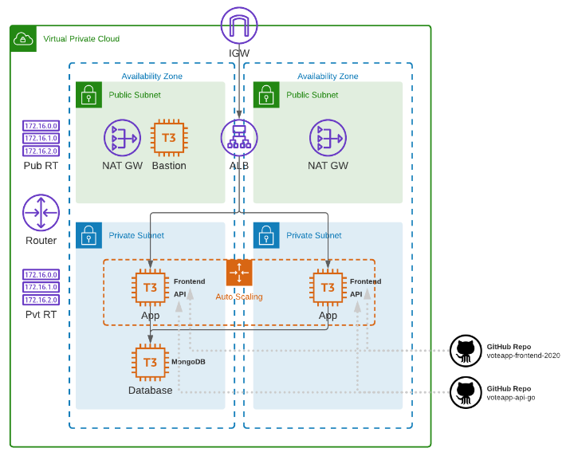

# Lab 013: Advanced VPC with Cloud-Native Application

- [Introduction](#introduction)
- [Pre-requisites](#pre-requisites)
- [Create the Config Files](#create-the-config-files)
- [Modularize Terraform Configuration files](#modularize-terraform-configuration-files)
    - [Network Module](#network-module)
    - [Security Module](#security-module)
    - [Bastion Module](#bastion-module)
    - [Storage Module](#storage-module)
    - [Application Module](#application-module)
- [Configure the variables file](#configure-the-variables-file)
- [Configure the outputs file](#configure-the-outputs-file)
- [About the Cloud-native Application](#about-the-cloud-native-application)
- [Time to Apply!](#time-to-apply)
- [Cleanup](#cleanup)
- [Resources](#resources)


## Introduction

In this lab, we'll create the following:

- A VPC spanning two availability zones
- each AZ will have a public and private subnet
- An internet gateway and a NAT gateway
- Public and private routes established
- An Application load BalAncer (ALB) which will loadbalance traffic across
- An autoscaling group of t3.micro instances with NGINX installed, and 
- A Cloud-native application consisting of a front-end and an API,
- A database instance running MongoDB

Diagram:
  


Local environment used for this lab. 

- Windows machine/laptop
- Visual Studio Code v1.67.2 (VSCode)
- WSL on Visual Studio Code
- Amazon Web Services (AWS) resources

## Pre-requisites 

- [Setup Keys and Permissions](../README.md#pre-requisites)
- [Setup your Local Environment and Install Extensions](../README.md#pre-requisites) 
- [Configure the Credentials File](../README.md#pre-requisites) 
- [Install Terraform](../README.md#pre-requisites) 

## Create the Config Files

From Hashicorp's documentation on [AWS Provider](https://registry.terraform.io/providers/hashicorp/aws/latest/docs):

> *Use the Amazon Web Services (AWS) provider to interact with the many resources supported by AWS. You must configure the provider with the proper credentials before you can use it.*

<details><summary> provider.tf </summary>
 
```bash
### provider.tf
terraform {
  required_version = ">= 0.12"

  required_providers {
    aws = {
      source  = "hashicorp/aws"
      version = ">= 4.16.0"
    }
  }
}

provider "aws" {
  region                   = var.aws_region
  shared_credentials_files = var.my_credentials
  profile                  = var.my_profile
}
```
 
</details>
<br>

In addition to this, we can also create the following files inside the project directory. We'll leave them blank for now as we will be configuring them later.

```bash
touch main.tf
touch terraform.tfvars
touch variables.tf
touch datasources.tf
touch outputs.tf
```

## Modularize Terraform Configuration files

In the previous labs, we've done all the core configurations in the main.tf file. This is alright if you're building a fairly simple system, but it gets messy (and increasingly long) as you build more and more complex setups.

To keep our main.tf file clutter-free and easy to read, we will utilize [Terraform AWS modules](https://registry.terraform.io/namespaces/terraform-aws-modules) which will help us modularize the parts and keep each one in their respective directories.

Create the **modules** directory and child modules inside it. The modules that we'll be using are:

- application
- bastion
- network
- security
- storage

```bash
mkdir -p modules/{application,bastion,network,security,storag
e} 
```

Inside each of the child modules, create the **main.tf**, **outputs.tf**, and **vars.tf**. These will be the core config files for each module.

```bash
touch modules/{application,bastion,network,security,storage}/
{main.tf,outputs.tf,vars.tf} 
```

The project directory should now look like this.

```bash
$ tree

├── datasources.tf
├── main.tf
├── modules
│   ├── application
│   │   ├── main.tf
│   │   ├── outputs.tf
│   │   └── vars.tf
│   ├── bastion
│   │   ├── main.tf
│   │   ├── outputs.tf
│   │   └── vars.tf
│   ├── network
│   │   ├── main.tf
│   │   ├── outputs.tf
│   │   └── vars.tf
│   ├── security
│   │   ├── main.tf
│   │   ├── outputs.tf
│   │   └── vars.tf
│   └── storage
│       ├── main.tf
│       ├── outputs.tf
│       └── vars.tf
└── outputs.tf
├── provider.tf
├── terraform.tfvars
└── variables.tf

6 directories, 21 files
```

Let's now create the global **main.tf** file.

<details><summary> main.tf </summary>
 
```bash
### main.tf
module "network" {
  source = "./modules/network"

  availability_zones = var.availability_zones
  cidr_block         = var.cidr_block
}

module "security" {
  source = "./modules/security"

  vpc_id         = module.network.vpc_id
  workstation_ip = var.my_ip

  depends_on = [
    module.network
  ]
}

module "bastion" {
  source = "./modules/bastion"

  instance_ami  = var.instance_ami
  instance_type = var.bastion_instance_type
  key_name      = var.key_pair
  subnet_id     = module.network.public_subnets[0]
  sg_id         = module.security.bastion_sg_id

  depends_on = [
    module.network,
    module.security
  ]
}

module "storage" {
  source        = "./modules/storage"
  instance_ami  = var.instance_ami
  instance_type = var.db_instance_type
  key_name      = var.key_pair
  subnet_id     = module.network.private_subnets[0]
  sg_id         = module.security.mongodb_sg_id

  depends_on = [
    module.network,
    module.security
  ]
}

module "application" {
  source = "./modules/application"

  instance_type   = var.app_instance_type
  key_name        = var.key_pair
  vpc_id          = module.network.vpc_id
  public_subnets  = module.network.public_subnets
  private_subnets = module.network.private_subnets
  webserver_sg_id = module.security.application_sg_id
  alb_sg_id       = module.security.alb_sg_id
  mongodb_ip      = module.storage.private_ip

  depends_on = [
    module.network,
    module.security,
    module.storage
  ]
}
```
</details>
<br>

Notice that in the main file, it references the modules, starting with **network**. Next to it, the **security** module defines the configurations for the security groups.

It's important to note that in the **security** block, there's a **depends_on** block which states that it needs an "output" from the **network** module.

This means that you can only reference values from modules if the module has defined an **output** for that value.

### Network Module

Looking inside the network module, we inspect the three files. The first one is the main.tf which si where we configure the VPC. 

The modules's main.tf uses variables that are pulled from the global main.tf file. These variables are defined in the module's vars.tf file. Lastly, it also returns output values which are defined in the outputs.tf file.

<details><summary> main.tf </summary>
 
```bash
# Creates the vpc.
module "vpc" {
  source = "terraform-aws-modules/vpc/aws"

  name = "lab06-vpc"
  cidr = var.cidr_block

  azs             = var.availability_zones
  public_subnets  = ["10.0.1.0/24", "10.0.2.0/24"]
  private_subnets = ["10.0.101.0/24", "10.0.102.0/24"]

  enable_nat_gateway = true
  enable_vpn_gateway = false

  tags = {
    Name = "lab06-vpc"
  }
}
```

</details>
 
<details><summary> vars.tf </summary>
 
```bash
variable "availability_zones" {}
variable "cidr_block" {}
```

</details>

<details><summary> outputs.tf </summary>
 
```bash
output "vpc_id" {
  description = "The ID of the VPC"
  value       = module.vpc.vpc_id
}

output "public_subnets" {
  description = "List of IDs of public subnets"
  value       = module.vpc.public_subnets
}

output "private_subnets" {
  description = "List of IDs of private subnets"
  value       = module.vpc.private_subnets
}
```

</details>
<br>

For more details, check out the Hashicorp documentation on [AWS VPC Terraform module](https://registry.terraform.io/modules/terraform-aws-modules/vpc/aws/latest).


### Security Module

These contain all the configurations for the security groups. In the module's main.tf file, we can see that we have four security groups:
 
- security group for the bastion 
- security group for the Application load balancer
- security group for the application itself 
- security group for the MongoDB database

We can also see the main.tf file that the security module is dependent on the success of the network module as it references the **vpc_id** output which will be returned by the network module.

<details><summary> main.tf </summary>
 
```bash
resource "aws_security_group" "lab06-sg-bastion" {
  name        = "lab06-sg-bastion"
  description = "bastion network traffic"
  vpc_id      = var.vpc_id

  ingress {
    description = "22 from workstation"
    from_port   = 22
    to_port     = 22
    protocol    = "tcp"
    cidr_blocks = [var.workstation_ip]
  }

  egress {
    from_port   = 0
    to_port     = 0
    protocol    = "-1"
    cidr_blocks = ["0.0.0.0/0"]
  }

  tags = {
    Name = "allow traffic"
  }
}

resource "aws_security_group" "lab06-sg-alb" {
  name        = "lab06-sg-alb"
  description = "alb network traffic"
  vpc_id      = var.vpc_id

  ingress {
    description = "80 from anywhere"
    from_port   = 80
    to_port     = 80
    protocol    = "tcp"
    cidr_blocks = ["0.0.0.0/0"]
  }

  egress {
    from_port       = 0
    to_port         = 0
    protocol        = "-1"
    security_groups = [aws_security_group.lab06-sg-application.id]
  }

  tags = {
    Name = "allow traffic"
  }
}

resource "aws_security_group" "lab06-sg-application" {
  name        = "lab06-sg-application"
  description = "application network traffic"
  vpc_id      = var.vpc_id

  ingress {
    description = "80 from alb"
    from_port   = 80
    to_port     = 80
    protocol    = "tcp"
    cidr_blocks = ["10.0.1.0/24", "10.0.2.0/24"]
    #security_groups  = [aws_security_group.alb.id]
  }

  ingress {
    description = "8080 from alb"
    from_port   = 8080
    to_port     = 8080
    protocol    = "tcp"
    cidr_blocks = ["10.0.1.0/24", "10.0.2.0/24"]
    #security_groups  = [aws_security_group.alb.id]
  }

  ingress {
    description     = "22 from bastion"
    from_port       = 22
    to_port         = 22
    protocol        = "tcp"
    security_groups = [aws_security_group.lab06-sg-bastion.id]
  }

  egress {
    from_port   = 0
    to_port     = 0
    protocol    = "-1"
    cidr_blocks = ["0.0.0.0/0"]
  }

  tags = {
    Name = "application allow traffic"
  }
}

resource "aws_security_group" "lab06-sg-mongodb" {
  name        = "lab06-sg-mongodb"
  description = "mongodb network traffic"
  vpc_id      = var.vpc_id

  ingress {
    description = "27017 from application"
    from_port   = 27017
    to_port     = 27017
    protocol    = "tcp"
    #cidr_blocks      = ["10.0.0.0/16"]
    security_groups = [aws_security_group.lab06-sg-application.id]
  }

  ingress {
    description     = "22 from bastion"
    from_port       = 22
    to_port         = 22
    protocol        = "tcp"
    security_groups = [aws_security_group.lab06-sg-bastion.id]
  }

  egress {
    from_port   = 0
    to_port     = 0
    protocol    = "-1"
    cidr_blocks = ["0.0.0.0/0"]
  }

  tags = {
    Name = "lab06-sg-mongodb"
  }
}
```
 
</details>
<br>

Like the previous one, the security module also uses variables which are declared in the vars.tf and returns output values defined in the outputs.tf.

<details><summary> vars.tf </summary>
 
```bash
variable "vpc_id" {}
variable "workstation_ip" {}
```
 
</details>

<details><summary> outputs.tf </summary>
 
```bash
output "application_sg_id" {
  description = "web server sg id"
  value       = aws_security_group.lab06-sg-application.id
}

output "alb_sg_id" {
  description = "alb sg id"
  value       = aws_security_group.lab06-sg-alb.id
}

output "mongodb_sg_id" {
  description = "mongodb sg id"
  value       = aws_security_group.lab06-sg-mongodb.id
}

output "bastion_sg_id" {
  description = "bastion sg id"
  value       = aws_security_group.lab06-sg-bastion.id
}
```
 
</details>

### Bastion Module

Here we have three config files as well. This module will launch a jumpbox that will allow us to access the instances in the private subnets.

The bastion will be deployed onto the first public subnet which is configured with a security group. The main.tf file defines all the "specs" for the instance. 

Notice that the module is also dependent on the success of the previous two module as it references the **private_subnet** output and **mongodb_sg_id** output from the network and security modules, respectively.

The module's main.tf file uses variables that are defined in the vars.tf. This module also returns the bastion's public IP as output values declared in the outputs.tf.

<details><summary> main.tf </summary>
 
```bash
resource "aws_instance" "lab06-bastion" {
  ami                         = var.instance_ami
  instance_type               = var.instance_type
  key_name                    = var.key_name
  subnet_id                   = var.subnet_id
  vpc_security_group_ids      = [var.sg_id]
  associate_public_ip_address = true

  tags = {
    Name  = "lab06-bastion"
  }
}
```
 
</details>

<details><summary> vars.tf </summary>
 
```bash
variable "instance_type" {}
variable "key_name" {}
variable "subnet_id" {}
variable "sg_id" {}
variable "instance_ami" {}
```
 
</details>

<details><summary> outputs.tf </summary>
 
```bash
output "public_ip" {
  description = "public ip address"
  value       = aws_instance.lab06-bastion.public_ip
}
```
 
</details>


### Storage Module

This module defines the configuration of the MongoDB database.From the main.tf file, we can see that this database instance won't be assigned with a public IP (unlike the bastion instance) as seen with the lack of the **associate_public_ip_address** field. This is because the database will be launched on a private subnet.

Note that we only configured a single database instance for our lab purposes only. it is best practice to configure [replicasets](https://www.mongodb.com/docs/manual/replication/#:~:text=A%20replica%20set%20is%20a,nodes%20are%20deemed%20secondary%20nodes.) for the database and the data stored in EBS that's provisioned with IOPS.

<details><summary> main.tf </summary>
 
```bash
resource "aws_instance" "lab06-mongo" {
  ami                    = var.instance_ami
  instance_type          = var.instance_type
  key_name               = var.key_name
  subnet_id              = var.subnet_id
  vpc_security_group_ids = [var.sg_id]

  user_data = filebase64("${path.module}/setup-mongodb.sh")

  tags = {
    Name  = "lab06-mongo"
  }
}
```
 
</details>
</br>

To bootstrap the instance with MongoDB, the module uses **user_data** to run the **setup-mongodb.sh**.

<details><summary> setup-mongodb.sh </summary>
 
```bash
#!/bin/bash

# Download and install mongoDB package
wget -qO - https://www.mongodb.org/static/pgp/server-4.2.asc | sudo apt-key add -
echo "deb [ arch=amd64,arm64 ] https://repo.mongodb.org/apt/ubuntu bionic/mongodb-org/4.2 multiverse" | sudo tee /etc/apt/sources.list.d/mongodb-org-4.2.list
apt-get -y update
apt-get install -y mongodb-org

# Configure the conf file
cat > /etc/mongod.conf << EOF
storage:
  dbPath: /var/lib/mongodb
  journal:
    enabled: true

systemLog:
  destination: file
  logAppend: true
  path: /var/log/mongodb/mongod.log

net:
  port: 27017
  bindIp: 0.0.0.0

processManagement:
  timeZoneInfo: /usr/share/zoneinfo
EOF

# Start the mongodb service
echo starting mongo...
systemctl start mongod

echo preparing mongodb data population script...
mkdir -p /tmp/lab06-app
cd /tmp/lab06-app

# Generates a file containing sample data which will populate the DB
cat > db.setup.js << EOF
use langdb;
db.languages.insert({"name" : "csharp", "codedetail" : { "usecase" : "system, web, server-side", "rank" : 5, "compiled" : false, "homepage" : "https://dotnet.microsoft.com/learn/csharp", "download" : "https://dotnet.microsoft.com/download/", "votes" : 0}});
db.languages.insert({"name" : "python", "codedetail" : { "usecase" : "system, web, server-side", "rank" : 3, "script" : false, "homepage" : "https://www.python.org/", "download" : "https://www.python.org/downloads/", "votes" : 0}});
db.languages.insert({"name" : "javascript", "codedetail" : { "usecase" : "web, client-side", "rank" : 7, "script" : false, "homepage" : "https://en.wikipedia.org/wiki/JavaScript", "download" : "n/a", "votes" : 0}});
db.languages.insert({"name" : "go", "codedetail" : { "usecase" : "system, web, server-side", "rank" : 12, "compiled" : true, "homepage" : "https://golang.org", "download" : "https://golang.org/dl/", "votes" : 0}});
db.languages.insert({"name" : "java", "codedetail" : { "usecase" : "system, web, server-side", "rank" : 1, "compiled" : true, "homepage" : "https://www.java.com/en/", "download" : "https://www.java.com/en/download/", "votes" : 0}});
db.languages.insert({"name" : "nodejs", "codedetail" : { "usecase" : "system, web, server-side", "rank" : 20, "script" : false, "homepage" : "https://nodejs.org/en/", "download" : "https://nodejs.org/en/download/", "votes" : 0}});
db.languages.find().pretty();
EOF

until mongo < db.setup.js; do sleep 5; done

echo fin v1.00!
```
 
</details>
</br>

This module also has variables and output values defined in the vars.tf and outputs.tf, respectively.

<details><summary> vars.tf </summary>
 
```bash
variable "instance_type" {}
variable "key_name" {}
variable "subnet_id" {}
variable "sg_id" {}
variable "instance_ami" {}
```
 
</details>

<details><summary> outputs.tf </summary>
 
```bash
output "private_ip" {
  description = "private ip address"
  value       = aws_instance.lab06-mongo.private_ip
}
```
 
</details>


### Application Module

This module is another important component as this setups the ALBs, Autoscaling group and the application itself.

The application load balancer (ALB) uses two target groups: 
- target group for the frontend webservers - listens to port 80
- target group for the API - listens to port 8080

The ALB is configured to listen on port 8080 and will forward the traffic to the target group based on the configured listener rules. This ensures traffice is loadbalanced across the instances in the auto caling group (ASG).

<details><summary> main.tf </summary>
 
```bash

#====================================

resource "aws_launch_template" "lab06-apptemplate" {
  name = "lab06-application"

  image_id               = data.aws_ami.ubuntu.id
  instance_type          = var.instance_type
  key_name               = var.key_name
  vpc_security_group_ids = [var.webserver_sg_id]
  user_data              = base64encode(data.template_cloudinit_config.config.rendered)

  tag_specifications {
    resource_type = "instance"

    tags = {
      Name  = "lab06-frontend-app"
      Owner = "Eden-Jose"

    }
  }

}

#====================================

resource "aws_lb" "lab06-alb" {
  name               = "lab06-alb"
  internal           = false
  load_balancer_type = "application"
  security_groups    = [var.alb_sg_id]
  subnets            = var.public_subnets

  enable_deletion_protection = false

  tags = {
    Environment = "Prod"
  }
}

resource "aws_alb_target_group" "lab06-tg-webserver" {
  name     = "lab06-tg-webserver"
  vpc_id   = var.vpc_id
  port     = 80
  protocol = "HTTP"

  health_check {
    path                = "/"
    interval            = 10
    healthy_threshold   = 3
    unhealthy_threshold = 6
    timeout             = 5
  }
}

resource "aws_alb_target_group" "lab06-tg-api" {
  name     = "lab06-tg-api"
  vpc_id   = var.vpc_id
  port     = 8080
  protocol = "HTTP"

  health_check {
    path                = "/ok"
    interval            = 10
    healthy_threshold   = 3
    unhealthy_threshold = 6
    timeout             = 5
  }
}

resource "aws_alb_listener" "lab06-listener-front_end" {
  load_balancer_arn = aws_lb.lab06-alb.arn
  port              = "80"
  protocol          = "HTTP"

  default_action {
    type             = "forward"
    target_group_arn = aws_alb_target_group.lab06-tg-webserver.arn
  }

  tags = {
    Name = "lab06-listener-front_end"
  }
}

resource "aws_alb_listener_rule" "lab06-listener-frontend_rule1" {
  listener_arn = aws_alb_listener.lab06-listener-front_end.arn
  priority     = 100

  condition {
    path_pattern {
      values = ["/"]
    }
  }

  action {
    type             = "forward"
    target_group_arn = aws_alb_target_group.lab06-tg-webserver.arn
  }

  tags = {
    Name = "lab06-listener-frontend_rule1"
  }
}

resource "aws_alb_listener_rule" "lab06-listener-api_rule1" {
  listener_arn = aws_alb_listener.lab06-listener-front_end.arn
  priority     = 10

  condition {
    path_pattern {
      values = [
        "/languages",
        "/languages/*",
        "/languages/*/*",
        "/ok"
      ]
    }
  }

  action {
    type             = "forward"
    target_group_arn = aws_alb_target_group.lab06-tg-api.arn
  }

  tags = {
    Name = "lab06-listener-api_rule1"
  }
}

#====================================

resource "aws_autoscaling_group" "lab06-asg" {
  name                = "lab06-asg"
  vpc_zone_identifier = var.private_subnets

  desired_capacity = var.asg_desired
  max_size         = var.asg_max_size
  min_size         = var.asg_min_size

  target_group_arns = [
    aws_alb_target_group.lab06-tg-webserver.arn, 
    aws_alb_target_group.lab06-tg-api.arn
    ]

  launch_template {
    id      = aws_launch_template.lab06-apptemplate.id
    version = "$Latest"
  }
}

```
 
</details>
</br>

The module also depends on the output values returned by the network, security, and storage modules.

In addition to this, we can see that the main file uses some [data sources](https://www.terraform.io/language/data-sources) which allows using data that are defined outside of Terraform or are define by another separate file. We've placed all the data sources in its separate file.

<details><summary> datasources.tf </summary>
 
```bash
data "aws_ami" "ubuntu" {
  most_recent = true

  filter {
    name   = "name"
    values = ["ubuntu/images/hvm-ssd/ubuntu-focal-20.04-amd64-server-*"]
  }

  filter {
    name   = "virtualization-type"
    values = ["hvm"]
  }

  # Canonical
  owners = ["099720109477"]
}

data "template_cloudinit_config" "config" {
  gzip          = false
  base64_encode = false

  #userdata
  part {
    content_type = "text/x-shellscript"
    content      = file("${path.module}/install-frontend-api.sh")
  }
}

data "aws_instances" "application" {
  instance_tags = {
    Name  = "lab06-frontendApp"
    Owner = "Eden Jose"
  }

  instance_state_names = ["pending", "running"]

  depends_on = [
    aws_autoscaling_group.lab06-asg
  ]
}
```
 
</details>
</br>

The bootstraping process is done within the **template_cloudinit_config** data source. It uses a script to install the frontend application and API onto the instances.

<details><summary> install-frontend-api.sh </summary>
 
```bash
#! /bin/bash
apt-get -y update
apt-get -y install nginx
apt-get -y install jq

# Creates the variables
# ALB_DNS defined where the frontend will forward the API requests to.
# MONGODB_PRIVATEIP defines where the data will be written to
ALB_DNS=${aws_lb.lab06-alb.dns_name}
MONGODB_PRIVATEIP=${var.mongodb_ip}

mkdir -p /tmp/cloudacademy-app
cd /tmp/cloudacademy-app

echo ===========================
echo FRONTEND - download latest release and install...
mkdir -p ./voteapp-frontend-react-2020
pushd ./voteapp-frontend-react-2020
curl -sL https://api.github.com/repos/cloudacademy/voteapp-frontend-react-2020/releases/latest | jq -r '.assets[0].browser_download_url' | xargs curl -OL
INSTALL_FILENAME=$(curl -sL https://api.github.com/repos/cloudacademy/voteapp-frontend-react-2020/releases/latest | jq -r '.assets[0].name')
tar -xvzf $INSTALL_FILENAME
rm -rf /var/www/html
cp -R build /var/www/html
cat > /var/www/html/env-config.js << EOFF
window._env_ = {REACT_APP_APIHOSTPORT: "$ALB_DNS"}
EOFF
popd

echo ===========================
echo API - download latest release, install, and start...
mkdir -p ./voteapp-api-go
pushd ./voteapp-api-go
curl -sL https://api.github.com/repos/cloudacademy/voteapp-api-go/releases/latest | jq -r '.assets[] | select(.name | contains("linux-amd64")) | .browser_download_url' | xargs curl -OL
INSTALL_FILENAME=$(curl -sL https://api.github.com/repos/cloudacademy/voteapp-api-go/releases/latest | jq -r '.assets[] | select(.name | contains("linux-amd64")) | .name')
tar -xvzf $INSTALL_FILENAME
#start the API up...
MONGO_CONN_STR=mongodb://$MONGODB_PRIVATEIP:27017/langdb ./api &
popd

systemctl restart nginx
systemctl status nginx
echo fin v1.00!
```
 
</details>
<br>

In this script, we can see the following lines which pulls the latest frontend release from the Github repo and stores into the NGINX default serving directory.

```bash
echo ===========================
echo FRONTEND - download latest release and install...
mkdir -p ./voteapp-frontend-react-2020
pushd ./voteapp-frontend-react-2020
curl -sL https://api.github.com/repos/cloudacademy/voteapp-frontend-react-2020/releases/latest | jq -r '.assets[0].browser_download_url' | xargs curl -OL
INSTALL_FILENAME=$(curl -sL https://api.github.com/repos/cloudacademy/voteapp-frontend-react-2020/releases/latest | jq -r '.assets[0].name')
tar -xvzf $INSTALL_FILENAME
rm -rf /var/www/html
cp -R build /var/www/html
cat > /var/www/html/env-config.js << EOFF
window._env_ = {REACT_APP_APIHOSTPORT: "$ALB_DNS"}
EOFF
popd 
```

The lines that follow then pulls the latest API release, starts up, and points to the MongoDB's private IP addresses on port 27017.

```bash
echo ===========================
echo API - download latest release, install, and start...
mkdir -p ./voteapp-api-go
pushd ./voteapp-api-go
curl -sL https://api.github.com/repos/cloudacademy/voteapp-api-go/releases/latest | jq -r '.assets[] | select(.name | contains("linux-amd64")) | .browser_download_url' | xargs curl -OL
INSTALL_FILENAME=$(curl -sL https://api.github.com/repos/cloudacademy/voteapp-api-go/releases/latest | jq -r '.assets[] | select(.name | contains("linux-amd64")) | .name')
tar -xvzf $INSTALL_FILENAME
#start the API up...
MONGO_CONN_STR=mongodb://$MONGODB_PRIVATEIP:27017/langdb ./api &
popd 
```

Next, the vars.tf file contains all the variables that will be passed by the global main.tf (this is the main.tf outside of the modules directory) to the modules.

<details><summary> vars.tf </summary>
 
```bash
variable "instance_type" {}
variable "key_name" {}
variable "vpc_id" {}
variable "public_subnets" {}
variable "private_subnets" {}
variable "webserver_sg_id" {}
variable "alb_sg_id" {}
variable "mongodb_ip" {}

variable "asg_desired" {
  type    = number
  default = 2
}
variable "asg_max_size" {
  type    = number
  default = 2
}
variable "asg_min_size" {
  type    = number
  default = 2
}
```
 
</details>
<br>

Lastly, the outputs.tf declares the outputs that are returned when the module is ran.

<details><summary> outputs.tf </summary>
 
```bash
output "dns_name" {
  description = "alb dns"
  value       = aws_lb.lab06-alb.dns_name
}

output "private_ips" {
  description = "application instance private ips"
  value       = data.aws_instances.application.private_ips
}
```
 
</details>


## Configure the variables file

Now that we understand the main config file and the modules it uses, there's only two more config file to complete our setup. Since our templates uses a ton of variables, we have to declare them in the variables.tf file

After that, we can then assign the values onto these variables through the terraform.tfvars file.

<details><summary> variables.tf </summary>
 
```bash
# Variables for setting up terraform

variable "aws_region" {
  description = "AWS region"
  type        = string
}

variable "my_profile" {
  description = "Profile to be used to connect to AWS"
  type        = string
}

variable "my_credentials" {
  description = "Credentials to be used to connect to AWS"
  type        = list(string)
}


# Variables for creating the VPC and EC2 instances

variable "key_pair" {
  description = "Key name"
  type        = string
}

# AMI for bastion and mongodb
variable "instance_ami" {
  type = string
}

variable "bastion_instance_type" {
  type = string
}

variable "app_instance_type" {
  type = string
}

variable "db_instance_type" {
  type = string
}

variable "availability_zones" {
  type = list(any)
}

variable "cidr_block" {
  type = string
}

variable "my_ip" {
  type = string
}
```
 
</details>

<details><summary> terraform.tfvars </summary>
 
```bash
# Variables for setting up terraform
aws_region     = "ap-southeast-1"
my_credentials = ["/mnt/c/Users/Eden.Jose/.aws/credentials"]
my_profile     = "vscode-dev"
key_pair       = "tf-user-keypair"

# Variables for creating the VPC and EC2 instances
availability_zones    = ["ap-southeast-1a", "ap-southeast-1b", "ap-southeast-1c"]
cidr_block            = "10.0.0.0/16"
bastion_instance_type = "t3.micro"
app_instance_type     = "t3.micro"
db_instance_type      = "t3.micro"

# AMI for bastion and mongodb
# Ubuntu Server 22.04 LTS (HVM), SSD Volume Type
instance_ami = "ami-04d9e855d716f9c99"
```
 
</details>

## Configure the outputs file

One more thing, we have to configure the outputs.tf file with the expected output values that will be returned once we run the template.

<details><summary> outputs.tf </summary>
 
```bash
output "alb_dns" {
  description = "alb dns"
  value       = module.application.dns_name
}

output "bastion_public_ip" {
  description = "bastion public ip"
  value       = module.bastion.public_ip
}

output "application_private_ips" {
  description = "application instance private ips"
  value       = module.application.private_ips
}

output "mongodb_private_ip" {
  description = "mongodb private ip"
  value       = module.storage.private_ip
}
```
 
</details>

## About the Cloud-native Application

Here are some details about the cloud-native application:

- It allows you to vote for your programming language
- Votes are then stored in a MongoDB database (launched on a private subnet)
- Data can be called to the frontend through API using Ajax calls 
- This API will then read and write to the MongoDB database.
- The weblayer where the autoscaling group is launched will run both the frontend and API
- The application will be pulling the the latest release from the repo below

The repo for the applications:

- [Frontend application](https://github.com/cloudacademy/voteapp-frontend-react-2020/releases/tag/1.0.21)
- [API](https://github.com/cloudacademy/voteapp-api-go/releases/tag/1.1.8)

## Time to Apply!

But first, let's export our [machine's IP](https://whatismyipaddress.com/) as a variable that'll be use by the Terraform template.

```bash
export TF_VAR_my_ip=1.2.3.4/32 
```

Initialize the working directory.

```bash
terraform init 
```

Check the formatting of the config files and then verify if the the configurations are syntactically valid.

```bash
terraform fmt 
terraform validate
```

Next, do a dry-run of the changes before actually applying the changes

```bash
terraform plan 
```

If there are no errors, it should return this message

```bash
Plan: 34 to add, 0 to change, 0 to destroy.

──────────────────────────────────────────────────────────

Note: You didn't use the -out option to save this plan, so Terraform can't guarantee to take exactly these actions if
you run "terraform apply" now.
```

Finally, apply the changes. It should return output values once it's successfully provisioned the resources.

```bash
terraform apply -auto-approve 
```
```bash
Apply complete! Resources: 34 added, 0 changed, 0 destroyed.

Outputs:

alb_dns = "lab06-alb-2087422437.ap-southeast-1.elb.amazonaws.com"
application_private_ips = tolist([
  "10.0.102.206",
  "10.0.101.107",
])
bastion_public_ip = "13.212.219.198"
mongodb_private_ip = "10.0.101.232"
```

Do a cURL on the ALB DNS name to check if it will return a "200 OK" response.

```bash
curl -I lab06-alb-2087422437.ap-southeast-1.elb.amazonaws.com

HTTP/1.1 200 OK
Date: Sat, 11 Jun 2022 15:21:15 GMT
Content-Type: text/html
Content-Length: 2505
Connection: keep-alive
Server: nginx/1.18.0 (Ubuntu)
Last-Modified: Sat, 11 Jun 2022 15:12:35 GMT
ETag: "62a4b0e3-9c9"
Accept-Ranges: bytes
```

Verify this response by checking the DNS name through a web browser. We can now vote on the language and these votes will be forwarded downstream onto the ALB then to the API target groups.

> *NOTE: As of 2022, there seems to be a bug on the application because it doesn't load the full webpage. As such, we can only test up to this point. The important thing is we're able to provision the resources and deploy the application*


The webpage should look like this.

  

However when I try to open the ALB's DNS name in the browser, I'm getting an incomplete webpage which doesn't display the voting tick boxes for the languages.

  


**In case the bug in the voting app is resolved**

Tried deploying the applications in different regions, and using different keypairs and API keys but it still doesn't display the "buttons".

In the event that this get resolved in the distant future, here's some ways to further test the application.

1. Inspect the traffic through the browser.

```bash
Click the three dots in the upper right --> More tools --> Developer tools 
```

2. When you vote, a "vote" HTTP request will appear on the lower left. Click the **Header**.

3. Connect to the bastion host then to the mongodb instance

```bash
ssh -i "keypair.pem" ubuntu@<public-ip-bastion> 
ssh ubuntu@<private-ip-mongodb>
```

4. Run the DB client and check the data stored in it.

```bash
mongo

> use langdb
> db.languages.find().pretty()

```

## Cleanup

To delete all the resources, just run the **destroy** command.

```bash
terraform destroy -auto-approve 
```

## Resources

- [Provisioning AWS Infrastructure.](https://cloudacademy.com/course/terraform-provisioning-aws-infrastructure/course-introduction/?context_resource=lp&context_id=2377)