## Lab 01: Build a Dev Environment with Terraform and AWS

> *This lab is based on Derek Morgan's course, ["Build a Dev Environment with Terraform and AWS"](https://github.com/morethancertified/rfp-terraform)*

In this lab, we'll build the following resources in AWS

- VPC
- route table
- Internet gateway
- public subnet
- security group
- an EC2 instance

  

Below is the environment I am using for this lab. 
- Windows machine/laptop
- Visual Studio Code v1.67.2 (VSCode)
- WSL on Visual Studio Code
- Amazon Web Services (AWS) resources

----------------------------------------------

### Authentication

Before we start with building the code, we have to ensure that we'll be able to authenticate using API keys. 

Follow these steps to [create the API keys and the credentials file locally.](../README.md)                         

----------------------------------------------

### Setup Local Environment

For this one, I'm using VS Code. We'll set it up with the following extensions:

- AWS Toolkit Extension
- Terraform Extension

Follow these steps to [setup your Visual Studio Code.](../README.md)  
 
----------------------------------------------

### Install Terraform

To use Terraform, it needs to be installed on our local machine.

Follow these steps to [install Terraform.](../README.md)

----------------------------------------------

### Configure AWS Provider

From the [Hashicorp's documentation](https://registry.terraform.io/providers/hashicorp/aws/latest/docs):

> Use the Amazon Web Services (AWS) provider to interact with the many resources supported by AWS. You must configure the provider with the proper credentials before you can use it.

Since we already created the credentials file, we can proceed to creating the provider file. 

Note that it is recommended to use variableS for configuration files instead of hardcoding any credentials. Another option is to specify the credentials file path.

```bash
$ cat > provider.tf

terraform {
  required_providers {
    aws = {
      source  = "hashicorp/aws"
      version = "~> 3.0"
    }
  }
}

# Configure the AWS Provider
provider "aws" {
  region                   = "ap-southeast-1"
  shared_credentials_file  = "/mnt/c/Users/Eden.Jose/.aws/credentials"
  profile                  = "vscode-dev"
}
```

Initialize.
```bash
$ terraform  init
```

----------------------------------------------

### Provision a VPC

From the Hashicorp documentation, we could see various AWS resources can be deployed. For this step, we'll be using [aws_vpc](https://registry.terraform.io/providers/hashicorp/aws/latest/docs/resources/vpc) to provide a VPC resource.

Let's start with creating a main file. Here we'll specify the following:
- VPC name "tf-vpc" after the **aws_vpc**
- cidr block of 10.123.0.0/16
- enable hostname
- enable dns support, optional

```bash
resource "aws_vpc" "tf-vpc" {
   cidr_block = "10.123.0.0/16"
   enable_dns_hostnames = true
   enable_dns_support = true

   tags = {
       Name = "tf-vpc-dev"
   }
} 
```

To get a "preview" without actually provisioning the resources,
```bash
$ terraform plan
```

This should return a list of resources that would be created if the template is ran. Below is an example output.

<details><summary> output for terraform plan</summary>

```bash
$ terraform plan

Terraform used the selected providers to generate the following execution plan. Resource actions are indicated with the
following symbols:
  + create

Terraform will perform the following actions:

  # aws_vpc.tf-vpc will be created
  + resource "aws_vpc" "tf-vpc" { 
      + arn                                  = (known after apply)
      + cidr_block                           = "10.123.0.0/16"
      + default_network_acl_id               = (known after apply)
      + default_route_table_id               = (known after apply)
      + default_security_group_id            = (known after apply)
      + dhcp_options_id                      = (known after apply)
      + enable_classiclink                   = (known after apply)
      + enable_classiclink_dns_support       = (known after apply)
      + enable_dns_hostnames                 = true
      + enable_dns_support                   = true
      + id                                   = (known after apply)
      + instance_tenancy                     = "default"
      + ipv6_association_id                  = (known after apply)
      + ipv6_cidr_block                      = (known after apply)
      + ipv6_cidr_block_network_border_group = (known after apply)
      + main_route_table_id                  = (known after apply)
      + owner_id                             = (known after apply)
      + tags                                 = {
          + "Name" = "tf-vpc-dev"
        }
      + tags_all                             = {
          + "Name" = "tf-vpc-dev"
        }
    }

Plan: 1 to add, 0 to change, 0 to destroy.
```

</details>
</br>

To actually provision the resources,
```bash
$ terraform apply 
```

Notice that this will do another **terraform plan**, after which you'll be asked if you want to perform the actions. 

To run the command above without the interactive prompt,
```bash
$ terraform apply -auto-approve
```

When the command is finished running, it should return the followin message:

```bash
Plan: 1 to add, 0 to change, 0 to destroy.
aws_vpc.tf-vpc: Creating...
aws_vpc.tf-vpc: Still creating... [10s elapsed]
aws_vpc.tf-vpc: Creation complete after 15s [id=vpc-00203af585d54c4f0]

Apply complete! Resources: 1 added, 0 changed, 0 destroyed.
```

On the Explorer tab on the left in VSCode, you should still see the available resources for Asia Pacific region when you click the AWS icon on the left panel. Sctoll at the bottom and then click,

```bash
Resources --> Enable resources types... -->  AWS::EC2::VPC --> OK
```

  
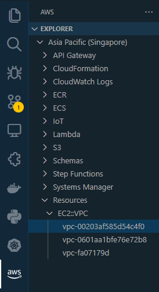  

When you click the VPC ID, it should open the configuration file.

```bash
{
    "VpcId": "vpc-00203af585d54c4f0",
    "InstanceTenancy": "default",
    "CidrBlockAssociations": [
        "vpc-cidr-assoc-0546f97f1de6e8d65"
    ],
    "CidrBlock": "10.123.0.0/16",
    "DefaultNetworkAcl": "acl-0b52f6d2d6f4c8339",
    "EnableDnsSupport": true,
    "Ipv6CidrBlocks": [],
    "DefaultSecurityGroup": "sg-06fc3a39cbe08b627",
    "EnableDnsHostnames": true,
    "Tags": [
        {
            "Value": "tf-vpc-dev",
            "Key": "Name"
        }
    ]
} 
```

----------------------------------------------

### Terraform State

From the Hashicorp documentation page on [terraform state](https://www.terraform.io/language/state) :

> Terraform must store state about your managed infrastructure and configuration. This state is used by Terraform to map real world resources to your configuration, keep track of metadata, and to improve performance for large infrastructures.
> 
> This state is stored by default in a local file named "terraform.tfstate", but it can also be stored remotely, which works better in a team environmen

To access the state through the CLI,

```bash
$ terraform state list 

aws_vpc.tf-vpc
```

To see details of the VPC through the CLI, run the command below. This will return the same information that you see on the state file.

```bash
$ terraform state show aws_vpc.tf-vpc
```

To see the entire state,

```bash
$ terraform show  
```

----------------------------------------------

### Terraform Destroy

From Hashicorp documentation page on [terraform destroy](https://www.terraform.io/cli/commands/destroy):

> The terraform destroy command is a convenient way to destroy all remote objects managed by a particular Terraform configuration.
> 
> While you will typically not want to destroy long-lived objects in a production environment, Terraform is sometimes used to manage ephemeral infrastructure for development purposes, in which case you can use terraform destroy to conveniently clean up all of those temporary objects once you are finished with your work.

To see a "preview" of the resources that will be destroyed before actually deleting them,
```bash
$ terraform plan -destroy 
```

To actually delete the resource without being prompted to confirm,
```bash
$ terraform destroy -auto-approve
```

----------------------------------------------

### Deploy a Public Subnet

From Hashicorp documentation page on [AWS VPC Subnets](https://registry.terraform.io/providers/hashicorp/aws/latest/docs/resources/subnet):

> Provides an VPC subnet resource.

The documentation page is straightforward and we could simply the basic usage example. Note that we're launching a public subnet, we will need **map_public_ip_on_launch** set to **true** to ensure EC2 instances that will be launched in the  public subnet will be assigned a public IP.

Back on the main file, we'll add the resource **aws_subnet** and name it **tf-public-subnet-1**

<details><summary> main.tf</summary>

```bash
resource "aws_vpc" "tf-vpc" {
   cidr_block = "10.123.0.0/16"
   enable_dns_hostnames = true
   enable_dns_support = true

   tags = {
       Name = "tf-vpc-dev"
   }
} 

resource "aws_subnet" "tf-public-subnet-1" {
  vpc_id     = aws_vpc.tf-vpc.id
  cidr_block = "10.123.1.0/24"
  map_public_ip_on_launch = true
  availability_zone = "ap-southeast-1a"

  tags = {
    Name = "tf-public-subnet-1"
  }
}
```
</details>
</br>

Review.

```bash
$ terraform plan 
```

Once you've reviewed, apply.

```bash
$ terraform apply -auto-approve 
```

Note that you cannot view the newly created subnet in the VSCode Explorer tab but you can verify them through the CLI.

```bash
$ terraform state list

aws_subnet.tf-public-subnet-1
aws_vpc.tf-vpc
```

Similarly, you can also check them on the AWS console.

  
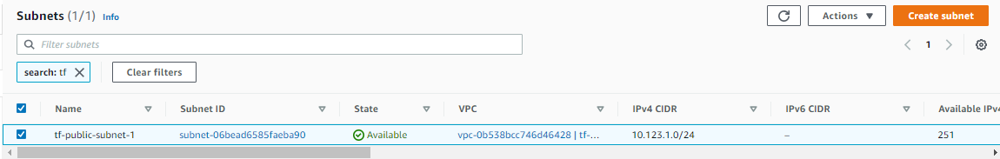  

----------------------------------------------

### Deploy an Internet Gateway

To allow internet access to our VPC, we would need to provision an internet gateway. You can read more on the [Hashicorp documentation](https://registry.terraform.io/providers/hashicorp/aws/latest/docs/resources/internet_gateway).

Back in our main file, we'll add another resource **aws_internet_gateway** and name it **tf-igw-1**.

<details><summary> main.tf </summary>

```bash

resource "aws_vpc" "tf-vpc" {
   cidr_block = "10.123.0.0/16"
   enable_dns_hostnames = true
   enable_dns_support = true

   tags = {
       Name = "tf-vpc-dev"
   }
} 

resource "aws_subnet" "tf-public-subnet-1" {
  vpc_id     = aws_vpc.tf-vpc.id
  cidr_block = "10.123.1.0/24"
  map_public_ip_on_launch = true
  availability_zone = "ap-southeast-1a"

  tags = {
    Name = "tf-public-subnet-1"
  }
}

resource "aws_internet_gateway" "tf-igw-1" {
  vpc_id = aws_vpc.tf-vpc.id

  tags = {
    Name = "tf-igw-1"
  }
} 
```

</details>
</br>

Review.

```bash
$ terraform plan 
```

Once you've reviewed, apply.

```bash
$ terraform apply -auto-approve 
```

Verify through the VSCode Explorer tab on the left panel.

```bash
Resources --> Show Resources --> AWS::EC2::InternetGateway --> OK
```

  

Verify through the CLI.

```bash
$ terraform state list

aws_internet_gateway.tf-igw-1
aws_subnet.tf-public-subnet-1
aws_vpc.tf-vpc
```

----------------------------------------------

### Terraform Format

This is a neat feature which will correct any formatting errors that you may have on your template files.

```bash
$ terraform fmt 
```

----------------------------------------------

### Create the Route table

After you've provisioned an internet gateway, you need to create a route table to route traffic from the public subnet to the internet gateway.

When you search for the route table on the Hashicorp documentation, you'll see two resources, **aws_route_table** and **aws_route**

From the Hashicorp documentation on [aws_route_table](https://registry.terraform.io/providers/hashicorp/aws/latest/docs/resources/route_table):

> Provides a resource to create a VPC routing table.

From the Hashicorp documentation on [aws_route](https://registry.terraform.io/providers/hashicorp/aws/latest/docs/resources/route):

> Provides a resource to create a routing table entry (a route) in a VPC routing table.

On both page, you'll see the following,

> **NOTE on Route Tables and Routes:**
> Terraform currently provides both a standalone Route resource and a Route Table resource with routes defined in-line. At this time you cannot use a Route Table with in-line routes in conjunction with any Route resources. Doing so will cause a conflict of rule settings and will overwrite rules.

Back in our main file, we'll be using both resources. To allow our public subnet to access internet, we should specify the destination as **0.0.0.0/0**


<details><summary> main.tf</summary>

```bash
resource "aws_vpc" "tf-vpc" {
  cidr_block           = "10.123.0.0/16"
  enable_dns_hostnames = true
  enable_dns_support   = true

  tags = {
    Name = "tf-vpc-dev"
  }
}

resource "aws_subnet" "tf-public-subnet-1" {
  vpc_id                  = aws_vpc.tf-vpc.id
  cidr_block              = "10.123.1.0/24"
  map_public_ip_on_launch = true
  availability_zone       = "ap-southeast-1a"

  tags = {
    Name = "tf-public-subnet-1"
  }
}

resource "aws_internet_gateway" "tf-igw-1" {
  vpc_id = aws_vpc.tf-vpc.id

  tags = {
    Name = "tf-igw-1"
  }
}


resource "aws_route_table" "tf-rt-table" {
  vpc_id = aws_vpc.tf-vpc.id

  tags = {
    Name = "tf-rt-1-public"
  }
}

resource "aws_route" "tf-rt-route" {
  route_table_id         = aws_route_table.tf-rt-table.id
  destination_cidr_block = "0.0.0.0/0"
  gateway_id             = aws_internet_gateway.tf-igw-1.id
}
```
</details>
</br>

Review.

```bash
$ terraform plan 
```

Once you've reviewed, apply.

```bash
$ terraform apply -auto-approve 
```

Verify through the VSCode Explorer tab on the left panel.

```bash
Resources --> Show Resources --> AWS::EC2::Route --> OK
```

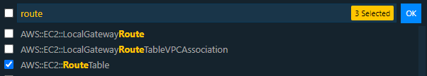  

Verify through the CLI.

```bash
$ terraform state list
```

----------------------------------------------

### Create the Route Table Association

From the Hashicorp documentation on [route table association](https://registry.terraform.io/providers/hashicorp/aws/latest/docs/resources/route_table_association):

> Provides a resource to create an association between a route table and a subnet or a route table and an internet gateway or virtual private gateway.

Back in our main file, add another resource called **aws_route_table_association** and name it **tf-rt-assoc-1**

<details><summary> main.tf </summary>
 
```bash
 
resource "aws_vpc" "tf-vpc" {
  cidr_block           = "10.123.0.0/16"
  enable_dns_hostnames = true
  enable_dns_support   = true

  tags = {
    Name = "tf-vpc-dev"
  }
}

resource "aws_subnet" "tf-public-subnet-1" {
  vpc_id                  = aws_vpc.tf-vpc.id
  cidr_block              = "10.123.1.0/24"
  map_public_ip_on_launch = true
  availability_zone       = "ap-southeast-1a"

  tags = {
    Name = "tf-public-subnet-1"
  }
}

resource "aws_internet_gateway" "tf-igw-1" {
  vpc_id = aws_vpc.tf-vpc.id

  tags = {
    Name = "tf-igw-1"
  }
}


resource "aws_route_table" "tf-rt-table" {
  vpc_id = aws_vpc.tf-vpc.id

  tags = {
    Name = "tf-rt-1-public"
  }
}

resource "aws_route" "tf-rt-route" {
  route_table_id         = aws_route_table.tf-rt-table.id
  destination_cidr_block = "0.0.0.0/0"
  gateway_id             = aws_internet_gateway.tf-igw-1.id
}

resource "aws_route_table_association" "tf-rt-assoc-1" {
  subnet_id      = aws_subnet.tf-public-subnet-1.id
  route_table_id = aws_route_table.tf-rt-table.id
}
```
 
</details>
</br>

Review.

```bash
$ terraform plan 
```

Once you've reviewed, apply.

```bash
$ terraform apply -auto-approve 
```

Similar with subnet, we also can't view the newly created resource through the VSCode Explorer tab on the left panel.

Instead, we could verify through the CLI.

```bash
$ terraform state list

aws_internet_gateway.tf-igw-1
aws_route.tf-rt-route
aws_route_table.tf-rt-table
aws_route_table_association.tf-rt-assoc-1
aws_subnet.tf-public-subnet-1
aws_vpc.tf-vpc
```

Check on the console.

  

----------------------------------------------

### Create the Security Group

From the Hashicorp documentation on [aws_security_group](https://registry.terraform.io/providers/hashicorp/aws/latest/docs/resources/security_group):

> Provides a security group resource.


From the Hashicorp documentation on [aws_security_group_rule](https://registry.terraform.io/providers/hashicorp/aws/latest/docs/resources/security_group_rule):

> Provides a security group rule resource. Represents a single ingress or egress group rule, which can be added to external Security Groups.

For our setup, we can simple use aws_security_group. Make sure to get your IP through [whatsmyip](https://whatismyipaddress.com/) and set it fro **cidr_blocks** under **ingress**.

<details><summary> main.tf </summary>
 
```bash

resource "aws_vpc" "tf-vpc" {
  cidr_block           = "10.123.0.0/16"
  enable_dns_hostnames = true
  enable_dns_support   = true

  tags = {
    Name = "tf-vpc-dev"
  }
}

resource "aws_subnet" "tf-public-subnet-1" {
  vpc_id                  = aws_vpc.tf-vpc.id
  cidr_block              = "10.123.1.0/24"
  map_public_ip_on_launch = true
  availability_zone       = "ap-southeast-1a"

  tags = {
    Name = "tf-public-subnet-1"
  }
}

resource "aws_internet_gateway" "tf-igw-1" {
  vpc_id = aws_vpc.tf-vpc.id

  tags = {
    Name = "tf-igw-1"
  }
}

resource "aws_route_table" "tf-rt-table" {
  vpc_id = aws_vpc.tf-vpc.id

  tags = {
    Name = "tf-rt-1-public"
  }
}

resource "aws_route" "tf-rt-route" {
  route_table_id         = aws_route_table.tf-rt-table.id
  destination_cidr_block = "0.0.0.0/0"
  gateway_id             = aws_internet_gateway.tf-igw-1.id
}

resource "aws_route_table_association" "tf-rt-assoc-1" {
  subnet_id      = aws_subnet.tf-public-subnet-1.id
  route_table_id = aws_route_table.tf-rt-table.id
}

resource "aws_security_group" "tf-sg-1" {
  name        = "tf-sg-1"
  description = "Allow inbound traffic"
  vpc_id      = aws_vpc.tf-vpc.id

  ingress {
    from_port   = 0
    to_port     = 0
    protocol    = "-1"
    cidr_blocks = ["180.190.52.180/32"]
  }

  egress {
    from_port   = 0
    to_port     = 0
    protocol    = "-1"
    cidr_blocks = ["0.0.0.0/0"]
  }

  tags = {
    Name = "tf-sg-1"
  }
}
```
 
</details>
</br>


Review.

```bash
$ terraform plan 
```

Once you've reviewed, apply.

```bash
$ terraform apply -auto-approve 
```

Verify through the CLI.

```bash
$ terraform state list

aws_internet_gateway.tf-igw-1
aws_route.tf-rt-route
aws_route_table.tf-rt-table
aws_route_table_association.tf-rt-assoc-1
aws_security_group.tf-sg-1
aws_subnet.tf-public-subnet-1
```

Check on the AWS console.

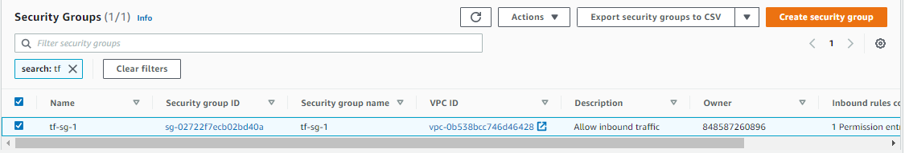  

----------------------------------------------

### Get the AMI Datasource

From the Hashicorp documentation on [Data Source-aws_ami](https://registry.terraform.io/providers/hashicorp/aws/latest/docs/data-sources/ami):

> Use this data source to get the ID of a registered AMI for use in other resources.

Before we proceed, we need to get the AMI ID which can be found in the EC2 menu through the AWS Console

```bash
EC2 --> Select AMI Catalog on the left panel --> Search Ubuntu --> Copy AMI ID
```

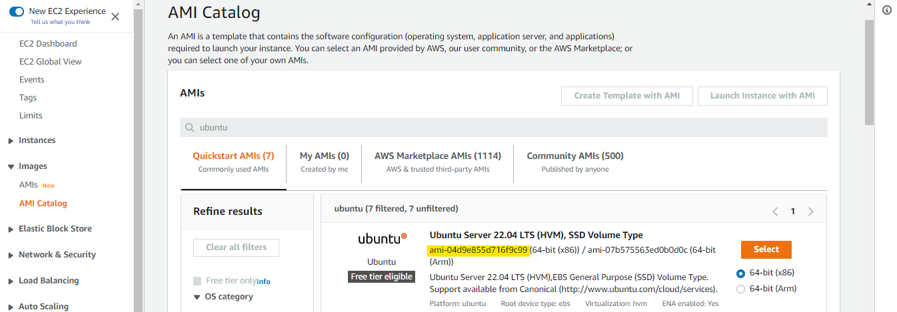   

Then select **AMI** on the left panel again and on the drop-down bar, choose **Public ../Images**.

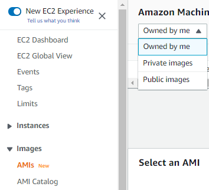  

Paste the AMI ID on the search bar and from the result, copy the owner ID and AMI name

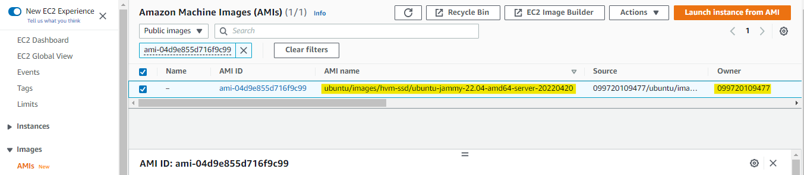  

Back on our lab directory, create another file called **datasource.tf**. On the values field under filter, put in the AMI name. To ensure that it will pull the most recent one, replace the 8-digits at the end of the AMI name with '*'

```bash
$ vim datasources.tf

data "aws_ami" "tf-ami" {
  most_recent = true
  owners      = ["099720109477"]

  filter {
    name   = "name"
    values = ["ubuntu/../images/hvm-ssd/ubuntu-jammy-22.04-amd64-server-*"]
  }
}
```

Review.

```bash
$ terraform plan 
```

Once you've reviewed, apply.

```bash
$ terraform apply -auto-approve 
```

----------------------------------------------

### Create a Keypair

For this step, we'll create a keypair that we'll be use by the EC2 instance to be created.

From the Hashicorp documentation on [aws_keypair](https://registry.terraform.io/providers/hashicorp/aws/latest/docs/resources/key_pair):

> Provides an EC2 key pair resource. A key pair is used to control login access to EC2 instances.
>
> Currently this resource requires an existing user-supplied key pair. This key pair's public key will be registered with AWS to allow logging-in to EC2 instances.

To start with, we'll need a keypair locally.

```bash
$ ssh-keygen -t ed25519

Generating public/private ed25519 key pair.
Enter file in which to save the key (/home/joseeden/.ssh/id_ed25519): /home/joseeden/.ssh/tf-keypair  
```

Back in our main.tf file, we'll add the resource **aws_keypair** and name it **tf-keypair** at the bottom. 


<details><summary> main.tf </summary>
 
```bash

resource "aws_vpc" "tf-vpc" {
  cidr_block           = "10.123.0.0/16"
  enable_dns_hostnames = true
  enable_dns_support   = true

  tags = {
    Name = "tf-vpc-dev"
  }
}

resource "aws_subnet" "tf-public-subnet-1" {
  vpc_id                  = aws_vpc.tf-vpc.id
  cidr_block              = "10.123.1.0/24"
  map_public_ip_on_launch = true
  availability_zone       = "ap-southeast-1a"

  tags = {
    Name = "tf-public-subnet-1"
  }
}

resource "aws_internet_gateway" "tf-igw-1" {
  vpc_id = aws_vpc.tf-vpc.id

  tags = {
    Name = "tf-igw-1"
  }
}

resource "aws_route_table" "tf-rt-table" {
  vpc_id = aws_vpc.tf-vpc.id

  tags = {
    Name = "tf-rt-1-public"
  }
}

resource "aws_route" "tf-rt-route" {
  route_table_id         = aws_route_table.tf-rt-table.id
  destination_cidr_block = "0.0.0.0/0"
  gateway_id             = aws_internet_gateway.tf-igw-1.id
}

resource "aws_route_table_association" "tf-rt-assoc-1" {
  subnet_id      = aws_subnet.tf-public-subnet-1.id
  route_table_id = aws_route_table.tf-rt-table.id
}

resource "aws_security_group" "tf-sg-1" {
  name        = "tf-sg-1"
  description = "Allow inbound traffic"
  vpc_id      = aws_vpc.tf-vpc.id

  ingress {
    from_port   = 0
    to_port     = 0
    protocol    = "-1"
    cidr_blocks = ["180.190.52.180/32"]
  }

  egress {
    from_port   = 0
    to_port     = 0
    protocol    = "-1"
    cidr_blocks = ["0.0.0.0/0"]
  }

  tags = {
    Name = "tf-sg-1"
  }
}

resource "aws_key_pair" "tf-keypair" {
  key_name   = "tf-keypair"
  public_key = file("/home/joseeden/.ssh/tf-keypair.pub")
}
```
 
</details>
</br>

Notice that instead of specifying the entire key in the **public_key** field as shown in the documentation, we use the [file](https://www.terraform.io/language/functions/file) function to pass the path of the key instead.

Review.

```bash
$ terraform plan 
```

Once you've reviewed, apply.

```bash
$ terraform apply -auto-approve
```

Keypairs aren't a visible resource in the VSCode AWS extension so we'll just verify through CLI and the AWS Console.


```bash
$ terraform state list

data.aws_ami.tf-ami
aws_internet_gateway.tf-igw-1
aws_key_pair.tf-keypair
aws_route.tf-rt-route
aws_route_table.tf-rt-table
aws_route_table_association.tf-rt-assoc-1
aws_security_group.tf-sg-1
aws_subnet.tf-public-subnet-1
aws_vpc.tf-vpc
```

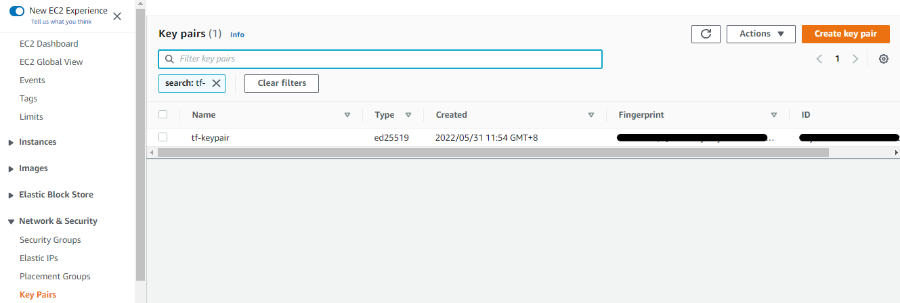  

----------------------------------------------

### Deploy the EC2 Instance

From the Hashicorp documentation on [aws_instance](https://registry.terraform.io/providers/hashicorp/aws/latest/docs/resources/instance):

> Provides an EC2 instance resource. This allows instances to be created, updated, and deleted. Instances also support provisioning.

Back in our main.tf file, we'll add a resource called **aws_instance** and name it **tf-node-1**

<details><summary> main.tf </summary>
 
```bash
resource "aws_vpc" "tf-vpc" {
  cidr_block           = "10.123.0.0/16"
  enable_dns_hostnames = true
  enable_dns_support   = true

  tags = {
    Name = "tf-vpc-dev"
  }
}

resource "aws_subnet" "tf-public-subnet-1" {
  vpc_id                  = aws_vpc.tf-vpc.id
  cidr_block              = "10.123.1.0/24"
  map_public_ip_on_launch = true
  availability_zone       = "ap-southeast-1a"

  tags = {
    Name = "tf-public-subnet-1"
  }
}

resource "aws_internet_gateway" "tf-igw-1" {
  vpc_id = aws_vpc.tf-vpc.id

  tags = {
    Name = "tf-igw-1"
  }
}

resource "aws_route_table" "tf-rt-table" {
  vpc_id = aws_vpc.tf-vpc.id

  tags = {
    Name = "tf-rt-1-public"
  }
}

resource "aws_route" "tf-rt-route" {
  route_table_id         = aws_route_table.tf-rt-table.id
  destination_cidr_block = "0.0.0.0/0"
  gateway_id             = aws_internet_gateway.tf-igw-1.id
}

resource "aws_route_table_association" "tf-rt-assoc-1" {
  subnet_id      = aws_subnet.tf-public-subnet-1.id
  route_table_id = aws_route_table.tf-rt-table.id
}

resource "aws_security_group" "tf-sg-1" {
  name        = "tf-sg-1"
  description = "Allow inbound traffic"
  vpc_id      = aws_vpc.tf-vpc.id

  ingress {
    from_port   = 0
    to_port     = 0
    protocol    = "-1"
    cidr_blocks = ["180.190.52.180/32"]
  }

  egress {
    from_port   = 0
    to_port     = 0
    protocol    = "-1"
    cidr_blocks = ["0.0.0.0/0"]
  }

  tags = {
    Name = "tf-sg-1"
  }
}

resource "aws_key_pair" "tf-keypair" {
  key_name   = "tf-keypair"
  public_key = file("/home/joseeden/.ssh/tf-keypair.pub")
}

resource "aws_instance" "tf-node-1" {
  instance_type          = "t2.micro"
  ami                    = data.aws_ami.tf-ami.id
  key_name               = aws_key_pair.tf-keypair.id
  vpc_security_group_ids = [aws_security_group.tf-sg-1.id]
  subnet_id              = aws_subnet.tf-public-subnet-1.id

  root_block_device {
    volume_size = 10
  }

  tags = {
    Name = "tf-node-1"
  }
}
```
 
</details>
</br>


Review.

```bash
$ terraform plan 
```

For this step, we'll just review. We'll pass the userdata next and then we apply.

----------------------------------------------

### Bootstrap EC2 with Userdata

We'll install the Docker engine on the EC2 instance using the userdata. To start with, let's first create the userdata script.

```bash
$ cat > userdata.tpl

#!/bin/bash
sudo apt-get update -y &&
sudo apt-get install -y \
apt-transport-https \
ca-certificates \
curl \
gnupg-agent \
software-properties-common &&
curl -fsSL https://download.docker.com/linux/ubuntu/gpg | sudo apt-key add - &&
sudo add-apt-repository "deb [arch=amd64] https://download.docker.com/linux/ubuntu $(lsb_release -cs) stable" &&
sudo apt-get update -y &&
sudo sudo apt-get install docker-ce docker-ce-cli containerd.io -y &&
sudo usermod -aG docker ubuntu
```

Back on our main.tf, add the **user_data** under the **aws_instance** resource.

<details><summary> main.tf </summary>
 
```bash
resource "aws_vpc" "tf-vpc" {
  cidr_block           = "10.123.0.0/16"
  enable_dns_hostnames = true
  enable_dns_support   = true

  tags = {
    Name = "tf-vpc-dev"
  }
}

resource "aws_subnet" "tf-public-subnet-1" {
  vpc_id                  = aws_vpc.tf-vpc.id
  cidr_block              = "10.123.1.0/24"
  map_public_ip_on_launch = true
  availability_zone       = "ap-southeast-1a"

  tags = {
    Name = "tf-public-subnet-1"
  }
}

resource "aws_internet_gateway" "tf-igw-1" {
  vpc_id = aws_vpc.tf-vpc.id

  tags = {
    Name = "tf-igw-1"
  }
}

resource "aws_route_table" "tf-rt-table" {
  vpc_id = aws_vpc.tf-vpc.id

  tags = {
    Name = "tf-rt-1-public"
  }
}

resource "aws_route" "tf-rt-route" {
  route_table_id         = aws_route_table.tf-rt-table.id
  destination_cidr_block = "0.0.0.0/0"
  gateway_id             = aws_internet_gateway.tf-igw-1.id
}

resource "aws_route_table_association" "tf-rt-assoc-1" {
  subnet_id      = aws_subnet.tf-public-subnet-1.id
  route_table_id = aws_route_table.tf-rt-table.id
}

resource "aws_security_group" "tf-sg-1" {
  name        = "tf-sg-1"
  description = "Allow inbound traffic"
  vpc_id      = aws_vpc.tf-vpc.id

  ingress {
    from_port   = 0
    to_port     = 0
    protocol    = "-1"
    cidr_blocks = ["180.190.52.180/32"]
  }

  egress {
    from_port   = 0
    to_port     = 0
    protocol    = "-1"
    cidr_blocks = ["0.0.0.0/0"]
  }

  tags = {
    Name = "tf-sg-1"
  }
}

resource "aws_key_pair" "tf-keypair" {
  key_name   = "tf-keypair"
  public_key = file("/home/joseeden/.ssh/tf-keypair.pub")
}

resource "aws_instance" "tf-node-1" {
  instance_type          = "t2.micro"
  ami                    = data.aws_ami.tf-ami.id
  key_name               = aws_key_pair.tf-keypair.id
  vpc_security_group_ids = [aws_security_group.tf-sg-1.id]
  subnet_id              = aws_subnet.tf-public-subnet-1.id
  user_data              = file("userdata.tpl")
  
  root_block_device {
    volume_size = 10
  }

  tags = {
    Name = "tf-node-1"
  }
}
```
 
</details>
</br>


Review.

```bash
$ terraform plan 
```

Once you've reviewed, apply.

```bash
$ terraform apply -auto-approve 
```

Provisioning the EC2 instance and running the userdata script will take a few minutes. Go to the AWS Console and verify that the EC2 instance is in "running" status.

  

Verify through the CLI.

```bash
$ terraform state list

data.aws_ami.tf-ami
aws_instance.tf-node-1
aws_internet_gateway.tf-igw-1
aws_key_pair.tf-keypair
aws_route.tf-rt-route
aws_route_table.tf-rt-table
aws_route_table_association.tf-rt-assoc-1
aws_security_group.tf-sg-1
aws_subnet.tf-public-subnet-1
aws_vpc.tf-vpc
```

Next step is to SSH to the newly created instance. You can get the IP from the AWS Console or you can also get it from the CLI.

```bash
$ terraform state list

data.aws_ami.tf-ami
aws_instance.tf-node-1
aws_internet_gateway.tf-igw-1
aws_key_pair.tf-keypair
aws_route.tf-rt-route
aws_route_table.tf-rt-table
aws_route_table_association.tf-rt-assoc-1
aws_security_group.tf-sg-1
aws_subnet.tf-public-subnet-1
aws_vpc.tf-vpc

$ terraform state aws_instance.tf-node-1

public_ip                            = "18.141.234.50"
```

Connect to the instance.

```bash
$ ssh -i ~/.ssh/tf-keypair ubuntu@18.141.234.50

ubuntu@ip-10-123-1-62:~$ docker -v
Docker version 20.10.16, build aa7e414
```

----------------------------------------------

### Create SSH Config Scripts - Templatefile

Search the **Remote-SSH** extensions in your VSCode.

  

For Windows machines, we can create a file named **ssh-windows.tpl**.

```bash
add-content -path c:/users/derek/.ssh/config -value @'

Host ${hostname}
  HostName ${hostname}
  User ${user}
  IdentityFile ${identityfile}
'@ 
```

Since I'm using WSL, I'll be creating a file named **ssh-linux.tpl**.

```bash
cat << EOF >> /mnt/c/Users/Eden.Jose/.ssh/config

Host ${hostname}
  HostName ${hostname}
  User ${user}
  IdentityFile ${identityfile}
EOF
```

----------------------------------------------

### Configure VSCode with Provisioner

From the Hashicorp documentation on [Provisioners](https://www.terraform.io/language/resources/provisioners/syntax):

> Provisioners can be used to model specific actions on the local machine or on a remote machine in order to prepare servers or other infrastructure objects for service.

**Provisioners as last resort**

Provisioners are created as a workaround for some functions that can't be directly represented in Terraform's declarative model. This could include:
- Passing data into virtual machines and other compute resources
- Running configuration management software
- First-class Terraform provider functionality may be available

Having said, it is not recommended to use provisioners on every deployment. Provisioner success and failure will not be reported by the terraform state. If something goes wrong, you can't roll back.

For this part of lab, it's okay to use provisioner since we're only modifying our config file through the local terminal.

Back in our main.tf file, we'll add a **provisioner** under the **aws_instance** resource.


<details><summary> main.tf </summary>
 
```bash

resource "aws_vpc" "tf-vpc" {
  cidr_block           = "10.123.0.0/16"
  enable_dns_hostnames = true
  enable_dns_support   = true

  tags = {
    Name = "tf-vpc-dev"
  }
}

resource "aws_subnet" "tf-public-subnet-1" {
  vpc_id                  = aws_vpc.tf-vpc.id
  cidr_block              = "10.123.1.0/24"
  map_public_ip_on_launch = true
  availability_zone       = "ap-southeast-1a"

  tags = {
    Name = "tf-public-subnet-1"
  }
}

resource "aws_internet_gateway" "tf-igw-1" {
  vpc_id = aws_vpc.tf-vpc.id

  tags = {
    Name = "tf-igw-1"
  }
}

resource "aws_route_table" "tf-rt-table" {
  vpc_id = aws_vpc.tf-vpc.id

  tags = {
    Name = "tf-rt-1-public"
  }
}

resource "aws_route" "tf-rt-route" {
  route_table_id         = aws_route_table.tf-rt-table.id
  destination_cidr_block = "0.0.0.0/0"
  gateway_id             = aws_internet_gateway.tf-igw-1.id
}

resource "aws_route_table_association" "tf-rt-assoc-1" {
  subnet_id      = aws_subnet.tf-public-subnet-1.id
  route_table_id = aws_route_table.tf-rt-table.id
}

resource "aws_security_group" "tf-sg-1" {
  name        = "tf-sg-1"
  description = "Allow inbound traffic"
  vpc_id      = aws_vpc.tf-vpc.id

  ingress {
    from_port   = 0
    to_port     = 0
    protocol    = "-1"
    cidr_blocks = ["180.190.52.180/32"]
  }

  egress {
    from_port   = 0
    to_port     = 0
    protocol    = "-1"
    cidr_blocks = ["0.0.0.0/0"]
  }

  tags = {
    Name = "tf-sg-1"
  }
}

resource "aws_key_pair" "tf-keypair" {
  key_name   = "tf-keypair"
  public_key = file("~/.ssh/tf-keypair.pub")
}

resource "aws_instance" "tf-node-1" {
  instance_type          = "t2.micro"
  ami                    = data.aws_ami.tf-ami.id
  key_name               = aws_key_pair.tf-keypair.id
  vpc_security_group_ids = [aws_security_group.tf-sg-1.id]
  subnet_id              = aws_subnet.tf-public-subnet-1.id
  user_data              = file("userdata.tpl")

  provisioner "local-exec" {
    command = templatefile("ssh-linux.tpl", {
      hostname     = self.public_ip,
      user         = "ubuntu",
      identityfile = "~/.ssh/tf-keypair"
    })
    # interpreter = ["Powershell", "-Command"]
    interpreter = ["bash", "-c"]
  }

  root_block_device {
    volume_size = 10
  }

  tags = {
    Name = "tf-node-1"
  }
}
```
 
</details>
</br>

Notice that we used a [templatefile](https://www.terraform.io/language/functions/templatefile) function to read the file from a given path. After the provisioner reads the config file, it passes the values onto the file. These values are the:
- IP of the instance
- username to be used for login
- identityfile, which is thee public key

Review.

```bash
$ terraform plan 
```

We can see from the output of the **plan** command that it didn't introduce any change to the state. This is because Terraform didn't detect anything different.

```bash
No changes. Your infrastructure matches the configuration. 
```

To update the EC2 instance, we'll use **-replace**.

```bash
$ terraform state list

data.aws_ami.tf-ami
aws_instance.tf-node-1
aws_internet_gateway.tf-igw-1
aws_key_pair.tf-keypair
aws_route.tf-rt-route
aws_route_table.tf-rt-table
aws_route_table_association.tf-rt-assoc-1
aws_security_group.tf-sg-1
aws_subnet.tf-public-subnet-1
aws_vpc.tf-vpc
```
```bash
$ terraform apply -replace aws_instance.tf-node-1 -auto-approve
```

Once it's finish running, check if the **config** file is created in your directory.

```bash
$ cat /mnt/c/Users/Eden.Jose/.ssh/config

Host 13.229.78.225
  HostName 13.229.78.225
  User ubuntu
  IdentityFile ~/.ssh/tf-keypair
```

Open **Remote-SSH** in VSCode. You should see the IP of your instance. When you click the IP, it will open a new VSCode window.

```bash
Click View --> Command Palette --> Remote-SSH: Connect to Host
```

  

Select Linux, then choose Continue.

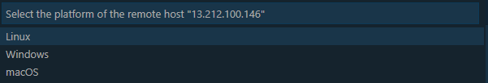  

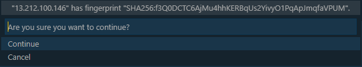  

On the new VSCode window, open a terminal. You should now see a different prompt.

```bash
Click Terminal --> New Terminal
```

Click the **Open Folder** on the left panel. Select the home directory and then click **Yes. I trust the authors.**

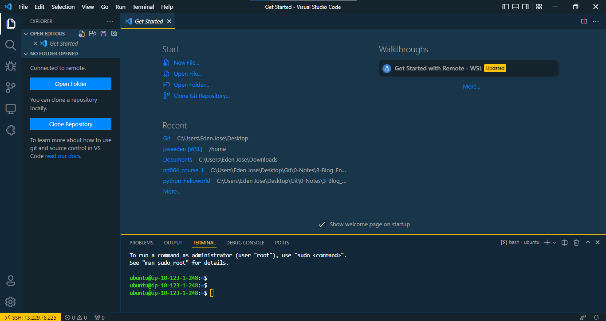  

 

  

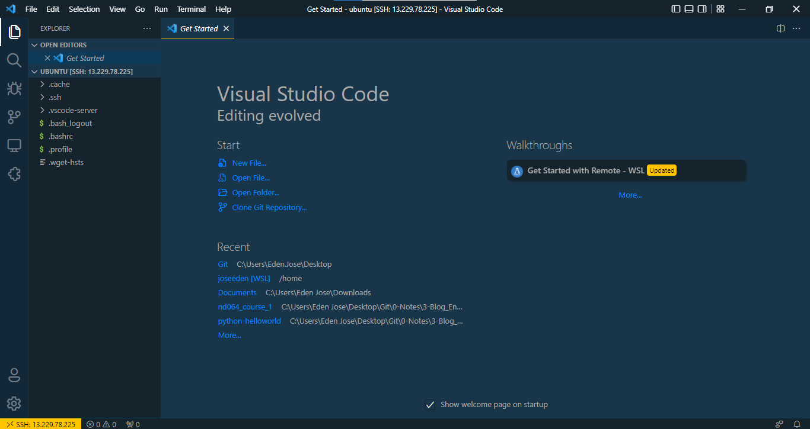  

----------------------------------------------

### Variables and their precedence

From the Hashicorp documentation on [Variable Definition Precedence:](https://www.terraform.io/language/values/variables)

> Terraform loads variables in the following order, with later sources taking precedence over earlier ones:
> - Environment variables
> - The terraform.tfvars file, if present.
> - The terraform.tfvars.json file, if present.
> - Any *.auto.tfvars or *.auto.tfvars.json files, processed in lexical order of their filenames.
> - Any -var and -var-file options on the command line, in the order they are provided. (This includes variables set by a Terraform Cloud workspace.)

To check the value of a variable that we currently have, we can use **console** and then type the variable name. As an example, let's create a **variables.tf** file.

```bash
$ cat > variables.tf

variables "host_os" {
    type = string
}
```

Let's now try to check the value of the variable through the CLI by using **console**. Notice that it will return nothing because we haven't specified a value to the variable yet.

```bash
$ terraform console

> var.host_os
(known after apply)
```

Let's specify a value to the variable in **variables.tf**

```bash
$ cat > variables.tf

variable "host_os" {
  type = string
  default = "linux" 
```

Using **console** again to check the value for the variable,

```bash
$ terraform console

> var.host_os
"linux" 
```

Let's create a new file called **terraform.tfvars**.

```bash
$ cat > terraform.tfvars

host_os = "windows"
```

Using **console** again to check the value for the same variable,

```bash
$ terraform console

> var.host_os
"windows" 
```

Here we can see that terraform gets the value from the **terraform.tfvars** instead of the **variables.tf**. This is because the default tfvars takes precedence over tf files.

**What if there's multiple tfvars file?**

Let's create **another.tfvars**

```bash
$ cat > another.tfvars

host_os = "debian"
```

To use this second tfvars file, we have to specify it as a parameter.

```bash
$ terraform console -var-file="another.tfvars"

> var.host_os
"debian"
```

Finally, we could override these files by specifying the variable through the commandline.

```bash
$ terraform console -var="host_os=unix"

> var.host_os
"unix"
```

----------------------------------------------

### Outputs

From the Hashicorp documentation on [outputs](https://www.terraform.io/language/values/outputs):

> Output values make information about your infrastructure available on the command line, and can expose information for other Terraform configurations to use. Output values are similar to return values in programming languages.

Let's create **outputs.tf** and put the value for the instance IP.

```bash
$ cat > outputs.tf

output "tf-node-1-ip" {
  value = aws_instance.tf-node-1.public_ip
} 
```

To apply the change without destroying and recreating the instance,

```bash
$ terraform apply -refresh-only
```

We can now see the output values "collected".

```bash
$ terraform output

tf-node-1-ip = "13.229.78.225"
```

----------------------------------------------

### References:

- [Github - morethancertified/rfp-terraform](https://github.com/morethancertified/rfp-terraform)
