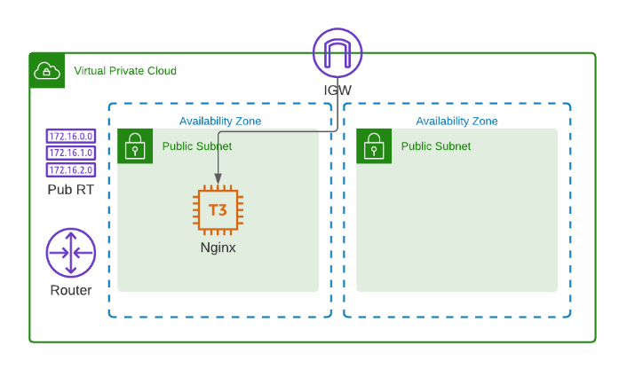
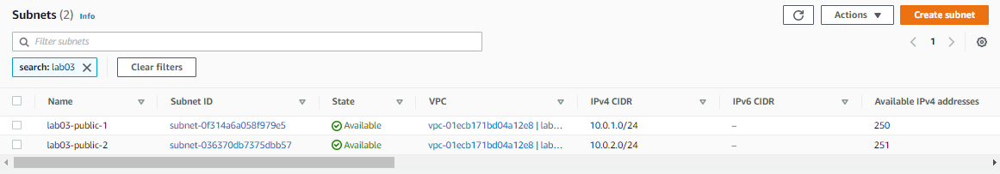
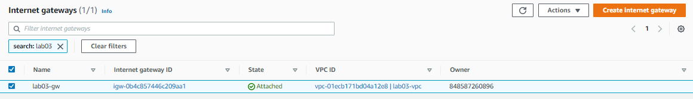
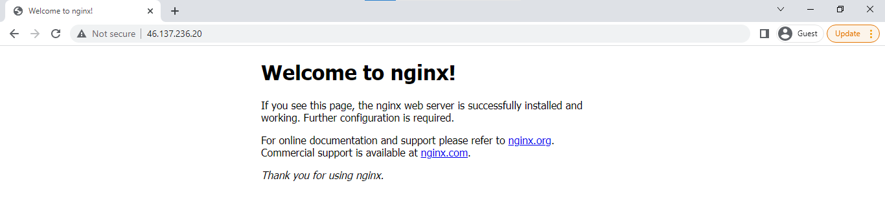

## Lab 03: VPC with EC2 instance

> *This lab is based on [cloudacademy/terraform-aws](https://github.com/cloudacademy/terraform-aws).*

Before we begin, make sure you've setup the following pre-requisites

  - [Setup Keys and Permissions](../README.md#pre-requisites)
  - [Setup your Environment and Install Extensions](../README.md#pre-requisites) 
  - [Install Terraform](../README.md#pre-requisites) 

In this lab, we'll create the following:

- a VPC spanning two availability zones
- two public subnets
- internet gateway and a single route table
- a security group
- a t3.micro instance with NGINX installed

  


Start with creating the project directory and initializing it.

```bash
$ mkdir lab03_VPC_with_EC2_Nginx
$ cd lab03_VPC_with_EC2_Nginx
$ terraform init
```

### Create the Provider file

Create the provider file.

<details><summary> provider.tf </summary>
 
```bash
 terraform {
  required_version = ">= 0.12"

  required_providers {
    aws = {
      source  = "hashicorp/aws"
      version = ">= 4.16.0"
    }
  }
}

provider "aws" {
  region                   = var.aws_region
  shared_credentials_files = var.my_credentials
  profile                  = var.my_profile
}

```
 
</details>

### Create the Main file

Create the main file which will contain all the core configurations.

<details><summary> main.tf </summary>
 
```bash
# lab03_VPC_with_EC2_Nginx
#--------------------------------------------------------------
# This terraform template deploys a VPC with 2 public subnets
# that has a security group, an internet gateway, and a 
# single route table. 
# An EC2 is also created with Nginx installe.

#--------------------------------------------------------------

# Creates the VPC.
resource "aws_vpc" "lab03-vpc" {
  cidr_block           = "10.0.0.0/16"
  instance_tenancy     = "default"
  enable_dns_support   = "true"
  enable_dns_hostnames = "true"

  tags = {
    Name = "lab03-vpc"
  }
}

# Creates the first public subnet.
resource "aws_subnet" "lab03-public-1" {
  vpc_id                  = aws_vpc.lab03-vpc.id
  cidr_block              = "10.0.1.0/24"
  map_public_ip_on_launch = true
  availability_zone       = var.avail_zones[0]

  tags = {
    Name = "lab03-public-1"
    Type = "Public"
  }
}

# Creates the second public subnet.
resource "aws_subnet" "lab03-public-2" {
  vpc_id                  = aws_vpc.lab03-vpc.id
  cidr_block              = "10.0.2.0/24"
  map_public_ip_on_launch = true
  availability_zone       = var.avail_zones[1]

  tags = {
    Name = "lab03-public-2"
    Type = "Public"
  }
}

# Creates the internet gateway.
resource "aws_internet_gateway" "lab03-gw" {
  vpc_id = aws_vpc.lab03-vpc.id

  tags = {
    Name = "lab03-gw"
  }
}

# Creates the route table.
resource "aws_route_table" "lab03-route-table" {
  vpc_id = aws_vpc.lab03-vpc.id

  route {
    cidr_block = "0.0.0.0/0"
    gateway_id = aws_internet_gateway.lab03-gw.id
  }

  tags = {
    Name = "lab03-route-table"
  }
}

# Associates the route table to the first public subnet
resource "aws_route_table_association" "lab03-route-assoc-1" {
  subnet_id      = aws_subnet.lab03-public-1.id
  route_table_id = aws_route_table.lab03-route-table.id
}

# Associates the route table to the second public subnet
resource "aws_route_table_association" "lab03-route-assoc-2" {
  subnet_id      = aws_subnet.lab03-public-2.id
  route_table_id = aws_route_table.lab03-route-table.id
}

# Creates the security group for the EC2-Nginx server.
resource "aws_security_group" "lab03-secgroup-1" {
  name        = "lab03-secgroup-1"
  description = "Allow web server network traffic"
  vpc_id      = aws_vpc.lab03-vpc.id

  ingress {
    description = "SSH from my IP"
    from_port   = 22
    to_port     = 22
    protocol    = "tcp"
    cidr_blocks = [var.my_ip]
  }

  ingress {
    description = "HTTP from anywhere"
    from_port   = 80
    to_port     = 80
    protocol    = "tcp"
    cidr_blocks = ["0.0.0.0/0"]
  }

  egress {
    from_port   = 0
    to_port     = 0
    protocol    = "-1"
    cidr_blocks = ["0.0.0.0/0"]
  }

  tags = {
    Name = "lab03-secgroup-1"
  }
}

# Creates the EC2 instance with NGINX installed
resource "aws_instance" "lab03-node-1" {
  instance_type               = var.instance_type
  ami                         = var.amis[var.aws_region]
  key_name                    = aws_key_pair.lab03-keypair.id
  vpc_security_group_ids      = [aws_security_group.lab03-secgroup-1.id]
  subnet_id                   = aws_subnet.lab03-public-1.id
  associate_public_ip_address = true
  user_data                   = file("webserver.tpl")

  root_block_device {
    volume_size = 10
  }

  tags = {
    Name = "lab03-node-1"
  }
}

# Imports the keypair
resource "aws_key_pair" "lab03-keypair" {
  key_name   = "lab03-keypair"
  public_key = file("~/.ssh/tf-keypair.pub")
}
```
</details>

### Create the Variables files

Notice that the main.tf has alot of **var.** statements. These reference the variables that are declared in the **variables.tf**. Note that you declare the variables in variables.tf, and you assign values to these variables through the **terraform.tfvars.**

<details><summary> variables.tf </summary>
 
```bash
# Variables for setting up terraform

variable "aws_region" {
  description = "AWS region"
  type        = string
}

variable "my_credentials" {
  description = "Credentials to be used to connect to AWS"
  type        = list(string)
}

variable "my_profile" {
  description = "Profile to be used to connect to AWS"
  type        = string
}

# Variables for creating the VPC and EC2 instances

variable "instance_type" {
  type = string
}

variable "avail_zones" {
  type = list(string)
}

variable "my_ip" {
  type = string
}

variable "amis" {
  type = map(any)
  default = {
    "ap-southeast-1" : "ami-04d9e855d716f9c99"
    "ap-northeast-1" : "ami-081ce1b631be2b337"
  }
}
```
 
</details>

<details><summary> terraform.tfvars </summary>
 
```bash
# Variables for setting up terraform
aws_region     = "ap-southeast-1"
my_credentials = ["/mnt/c/Users/Eden.Jose/.aws/credentials"]
my_profile     = "vscode-dev"

# Variables for creating the VPC and EC2 instances
avail_zones   = ["ap-southeast-1a", "ap-southeast-1b", "ap-southeast-1c"]
instance_type = "t3.micro"
```

</details>
</br>

As we will see, we can assign values to the variables in the .tfvars file but we can also assign values throug the commandline as environment variables.

### Create the Outputs file

Next, we'll create the outputs file. These contains the values that will be returned after we run the Terraform template.

<details><summary> outputs.tf </summary>
 
```bash
output "vpc_id" {
  value = aws_vpc.lab03-vpc.id
}

output "public_subnet1_id" {
  value = aws_subnet.lab03-public-1.id
}

output "public_subnet2_id" {
  value = aws_subnet.lab03-public-2.id
}

output "server_public_ip" {
  value = aws_instance.lab03-node-1.public_ip
}
```
 
</details>


### Test it out

Before we proceed, let's get our IP from [whatsmyip.](https://whatismyipaddress.com/). After that, we can assign our IP to a variable which will be used during the execution.

```bash
$ export TF_VAR_my_ip=1.2.3.4/32 
```

To check the environment variables,

```bash
$ set | grep TF_VAR 
```

We can now do a review by running the command below. This will return the expected changes that will be provision once we apply them.

```bash
$ terraform plan 
```

If no errors were returned, then we can now run the Terraform automation.

```bash
$ terraform apply -auto-approve 
```

It should return this message if the run was successful.

```bash
Apply complete! Resources: 10 added, 0 changed, 0 destroyed.

Outputs:

public_subnet1_id = "subnet-0f314a6a058f979e5"
public_subnet2_id = "subnet-036370db7375dbb57"
server_public_ip = "46.137.236.20"
vpc_id = "vpc-01ecb171bd04a12e8"
```

 
Go to the AWS Console and check if the resources are created.

  
  
  
  

Now let's test the webserver. Curl the IP. It should return a "200 OK" response.

```bash
$ curl -I 46.137.236.20

HTTP/1.1 200 OK
Server: nginx/1.18.0 (Ubuntu)
Date: Sun, 05 Jun 2022 10:23:40 GMT
Content-Type: text/html
Content-Length: 612
Last-Modified: Sun, 05 Jun 2022 10:07:14 GMT
Connection: keep-alive
ETag: "629c8052-264"
Accept-Ranges: bytes
```

You can also copy the IP and open it in a browser. You should see the NGINX landing page.

  

----------------------------------------------

### Cleanup

To delete all the resources, just run the **destroy** command.

```bash
$ terraform destroy -auto-approve 
```

