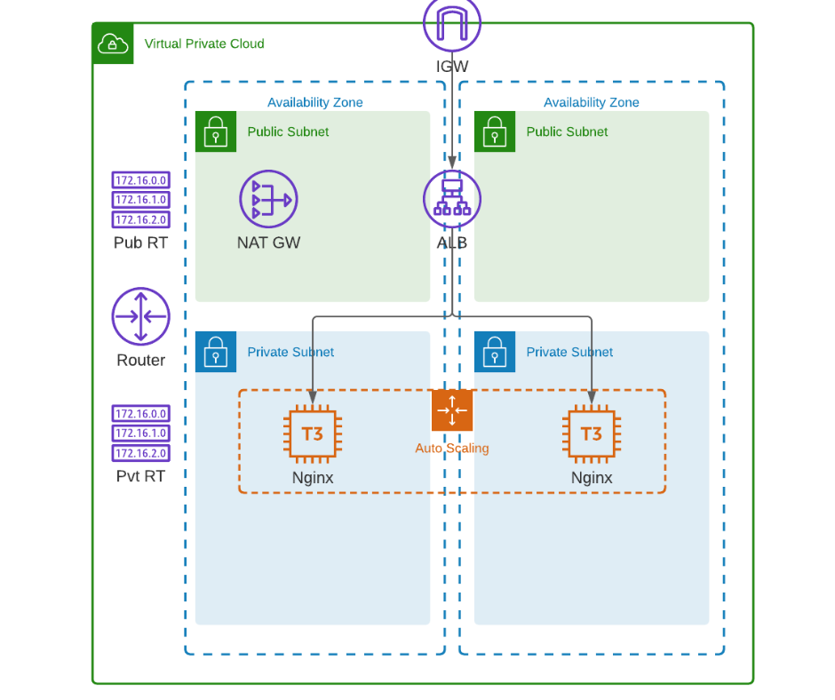

## Lab 05: Advanced VPC with ALB and EC2 instances - Simplified

This is a continuation of the previous lab on **Advanced VPC with ALB and EC2 instances.** In this lab, we'll be simplifying the configuration by using "count meta" argument.

We'll still use the same set of files.

<details><summary> provider.tf </summary>
 
```bash
terraform {
  required_version = ">= 0.12"

  required_providers {
    aws = {
      source  = "hashicorp/aws"
      version = ">= 4.16.0"
    }
  }
}

provider "aws" {
  region                   = var.aws_region
  shared_credentials_files = var.my_credentials
  profile                  = var.my_profile
}

```
 
</details>

<details><summary> variables.tf </summary>
 
```bash
# Variables for setting up terraform

variable "aws_region" {
  description = "AWS region"
  type        = string
}

variable "my_credentials" {
  description = "Credentials to be used to connect to AWS"
  type        = list(string)
}

variable "my_profile" {
  description = "Profile to be used to connect to AWS"
  type        = string
}

variable "my_ip" {
  type = string
}

# Variables for creating the VPC and EC2 instances

variable "instance_type" {
  type = string
}

variable "avail_zones" {
  type = list(string)
}

variable "cidr_block" {
  type = string
}


```
 
</details>

<details><summary> terraform.tfvars </summary>

```bash
# Variables for setting up terraform
aws_region     = "ap-southeast-1"
my_credentials = ["/mnt/c/Users/Eden.Jose/.aws/credentials"]
my_profile     = "vscode-dev"

# Variables for creating the VPC and EC2 instances
avail_zones   = ["ap-southeast-1a", "ap-southeast-1b", "ap-southeast-1c"]
instance_type = "t3.micro"
cidr_block    = "10.0.0.0/16" 
```

</details>

As a references, here's the diagram that we'll use.

  

Here's the modified main file.

<details><summary> main.tf </summary>
 
```bash
# lab04_VPC_with_EC2_Nginx
#---------------------------------------------------------------------
# This terraform template deploys a VPC with 2 public subnets that has 
# a security group, an internet gateway, a NAT gateway, and an 
# Application loadbalancer. Traffic will be loadbalanced between the 
# EC2 instances in the autoscaling group. Finally, the instances are 
# bootstrapped with an NGINX webserver.
#---------------------------------------------------------------------

resource "aws_vpc" "lab04-vpc" {
  cidr_block           = var.cidr_block
  instance_tenancy     = "default"
  enable_dns_support   = "true"
  enable_dns_hostnames = "true"

  tags = {
    Name = "lab04-vpc"
  }
}

# Creates the public subnet 1 and 2
resource "aws_subnet" "lab04-public-subnet" {
  map_public_ip_on_launch = true
  vpc_id                  = aws_vpc.lab04-vpc.id
  count                   = length(var.avail_zones)
  cidr_block              = cidrsubnet(var.cidr_block, 8, count.index)
  availability_zone       = element(var.avail_zones, count.index)

  tags = {
    Name = "lab04-public-subnet-${element(var.avail_zones, count.index)}"
    Type = "Public"
  }
}

# Creates the private subnet 1 and 2
resource "aws_subnet" "lab04-private-subnet" {
  map_public_ip_on_launch = true
  vpc_id                  = aws_vpc.lab04-vpc.id
  count                   = length(var.avail_zones)
  cidr_block              = cidrsubnet(var.cidr_block, 8, count.index + length(var.avail_zones))
  availability_zone       = element(var.avail_zones, count.index)

  tags = {
    Name = "lab04-private-subnet-${element(var.avail_zones, count.index)}"
    Type = "Public"
  }
}

resource "aws_internet_gateway" "lab04-igw" {
  vpc_id = aws_vpc.lab04-vpc.id

  tags = {
    Name = "lab04-igw"
  }
}

# Create the Elastic IPs per availability zone
resource "aws_eip" "lab04-eip-nat" {
  count = length(var.avail_zones)
  vpc   = true
}

# Creates the NAT gateway - Public NAT.
# This creates a NAT gateway in each availability zone.
resource "aws_nat_gateway" "lab04-natgw" {
  count         = length(var.avail_zones)
  allocation_id = element(aws_eip.lab04-eip-nat.*.id, count.index)
  subnet_id     = element(aws_subnet.lab04-public-subnet.*.id, count.index)

  tags = {
    Name = "lab04-natgw-${element(var.avail_zones, count.index)}"
  }

  # To ensure proper ordering, it is recommended to add an 
  # explicit dependency on the Internet Gateway for the VPC.
  depends_on = [aws_internet_gateway.lab04-igw]
}

#========================================================================
# Creates the route table. One route table per AZ
# This is a public route table that routes to the IGW.
resource "aws_route_table" "lab04-rt-public" {
  vpc_id = aws_vpc.lab04-vpc.id

  route {
    cidr_block = "0.0.0.0/0"
    gateway_id = aws_internet_gateway.lab04-igw.id
  }

  tags = {
    Name = "lab04-rt-public"
  }
}

# Associates the route table to the public subnet
resource "aws_route_table_association" "lab04-route-assoc-public" {
  count          = length(var.avail_zones)
  subnet_id      = element(aws_subnet.lab04-public-subnet.*.id, count.index)
  route_table_id = aws_route_table.lab04-rt-public.id
}

#========================================================================
# This is a private route table that routes to the NAT-GW.
resource "aws_route_table" "lab04-rt-private" {
  vpc_id = aws_vpc.lab04-vpc.id
  count  = length(var.avail_zones)

  route {
    cidr_block = "0.0.0.0/0"
    gateway_id = element(aws_nat_gateway.lab04-natgw.*.id, count.index)
  }

  tags = {
    Name = "lab04-rt-private-${element(var.avail_zones, count.index)}"
  }
}

# Associates the route table to the subnets
resource "aws_route_table_association" "lab04-route-assoc-private" {
  count          = length(var.avail_zones)
  subnet_id      = element(aws_subnet.lab04-private-subnet.*.id, count.index)
  route_table_id = element(aws_route_table.lab04-rt-private.*.id, count.index)
}
#========================================================================

# Creates the security group for the autoscaling group of wenservers
# Note that the egress traffic is routed to the ALB.
# This can be seen on the cidr_blocks of the second ingress.
resource "aws_security_group" "lab04-secgroup-1" {
  name        = "lab04-secgroup-1"
  description = "Allow web server network traffic"
  vpc_id      = aws_vpc.lab04-vpc.id

  ingress {
    description = "SSH from my IP"
    from_port   = 22
    to_port     = 22
    protocol    = "tcp"
    cidr_blocks = [var.my_ip]
  }

  ingress {
    description = "HTTP from anywhere, through the ALB"
    from_port   = 80
    to_port     = 80
    protocol    = "tcp"
    cidr_blocks = [
      cidrsubnet(var.cidr_block, 8, 1),
      cidrsubnet(var.cidr_block, 8, 2)
    ]
  }

  egress {
    from_port   = 0
    to_port     = 0
    protocol    = "-1"
    cidr_blocks = ["0.0.0.0/0"]
  }

  tags = {
    Name = "lab04-secgroup-1"
  }
}

# Creates the security group for the ALB
# This allows inbound traffic from the internet and
# allows outbound traffic to go through only the webserber security group
resource "aws_security_group" "lab04-secgroup-2" {
  name        = "lab04-secgroup-2"
  description = "Allow ALB network traffic"
  vpc_id      = aws_vpc.lab04-vpc.id

  ingress {
    description = "HTTP from anywhere"
    from_port   = 80
    to_port     = 80
    protocol    = "tcp"
    cidr_blocks = ["0.0.0.0/0"]
  }

  egress {
    from_port       = 0
    to_port         = 0
    protocol        = "-1"
    security_groups = [aws_security_group.lab04-secgroup-1.id]
  }

  tags = {
    Name = "lab04-secgroup-1"
  }
}

# Launch template for the autoscaling group
# The "webserver.tpl" bootstraps the instances in the ASG wIth NGINX.
# This uses string interpolation to inject the current module path.
resource "aws_launch_template" "lab04-launchtemplate-webserver" {
  name = "lab04-launchtemplate-webserver"

  image_id               = data.aws_ami.lab04_ami.id
  instance_type          = var.instance_type
  key_name               = aws_key_pair.lab04-keypair.id
  vpc_security_group_ids = [aws_security_group.lab04-secgroup-1.id]

  tag_specifications {
    resource_type = "instance"

    tags = {
      Name = "lab04-webserver"
    }
  }
  user_data = filebase64("${path.module}/webserver.tpl")
}

# Creates the external-facing ALB.
resource "aws_lb" "lab04-alb" {
  name                       = "lab04-alb"
  internal                   = false
  load_balancer_type         = "application"
  security_groups            = [aws_security_group.lab04-secgroup-2.id]
  enable_deletion_protection = false
  subnets                    = aws_subnet.lab04-public-subnet.*.id

  tags = {
    Environment = "PRD"
  }
}

resource "aws_lb_target_group" "lab04-alb-target-group" {
  name     = "lab04-alb-target-group"
  port     = 80
  protocol = "HTTP"
  vpc_id   = aws_vpc.lab04-vpc.id
}

resource "aws_lb_listener" "lab04-alb-front_end" {
  load_balancer_arn = aws_lb.lab04-alb.arn
  port              = "80"
  protocol          = "HTTP"

  default_action {
    type             = "forward"
    target_group_arn = aws_lb_target_group.lab04-alb-target-group.arn
  }
}

# Forwards the route path to the target group
resource "aws_lb_listener_rule" "lab04-alb-listener-rule-1" {
  listener_arn = aws_lb_listener.lab04-alb-front_end.arn
  priority     = 100

  action {
    type             = "forward"
    target_group_arn = aws_lb_target_group.lab04-alb-target-group.arn
  }

  condition {
    path_pattern {
      values = ["/"]
    }
  }
}

# Creates the ASG of webserver instances.
resource "aws_autoscaling_group" "lab04-asg" {
  name                = "lab04-asg"
  desired_capacity    = 2
  max_size            = 5
  min_size            = 2
  vpc_zone_identifier = aws_subnet.lab04-private-subnet.*.id

  target_group_arns = [
    aws_lb_target_group.lab04-alb-target-group.arn
  ]

  launch_template {
    id      = aws_launch_template.lab04-launchtemplate-webserver.id
    version = "$Latest"
  }
}

# Imports the keypair
resource "aws_key_pair" "lab04-keypair" {
  key_name   = "lab04-keypair"
  public_key = file("~/.ssh/tf-keypair.pub")
}
```
 
</details>
</br>

In here we can see that we now only have two resource **aws_subnet**, one for public and one for private. To understand what's assigned to the variables, we can use the **console** command.

```bash
$ terraform console

> var.avail_zones
tolist([
  "ap-southeast-1a",
  "ap-southeast-1b",
  "ap-southeast-1c",

> cidrsubnet(var.cidr_block, 8, 0)
"10.0.0.0/24"
> cidrsubnet(var.cidr_block, 8, 1)
"10.0.1.0/24"
> cidrsubnet(var.cidr_block, 8, 2)
"10.0.2.0/24"
> cidrsubnet(var.cidr_block, 8, 3)
"10.0.3.0/24"
> cidrsubnet(var.cidr_block, 8, 4)
"10.0.4.0/24"

> element(var.avail_zones, 1)
"ap-southeast-1b"
> element(var.avail_zones, 2)
"ap-southeast-1c"
> element(var.avail_zones, 3)
"ap-southeast-1a"
```

Before running any terraform commands, we need to [assign our IP](https://whatismyipaddress.com/) to a variable. Make sure to append the "/32" after your IP address.

```bash
export TF_VAR_my_ip=1.2.3.4/32 
```

Check if there are errors with the formatting.

```bash
$ terraform fmt 
```

Then check if the config files are valid.

```bash
$ terraform validate 
```

Finally, do a review to check what changes will be introduce when you actually run the template.

```bash
$ terraform plan 
```

If it doesn't return any error, you can now apply it.

```bash
$ terraform apply -auto-approve 
```

It should return the **Apply complete!** message, along with the output values.

```bash
Apply complete! Resources: 6 added, 3 changed, 3 destroyed.

Outputs:

alb_dns_name = "lab04-alb-2074635167.ap-southeast-1.elb.amazonaws.com"
private_cidr_blocks = [
  "10.0.3.0/24",
  "10.0.4.0/24",
  "10.0.5.0/24",
]
private_subnet_id = [
  "subnet-0461d695d3f32a8d7",
  "subnet-073703ca385d90aec",
  "subnet-0b2e94adc05022505",
]
public_cidr_blocks = [
  "10.0.0.0/24",
  "10.0.1.0/24",
  "10.0.2.0/24",
]
public_subnet_id = [
  "subnet-02f1c37fbbe36d1e4",
  "subnet-07d6f6e03c9283169",
  "subnet-06ba41c814e38bd3e",
]
vpc_id = "vpc-03d74d1e4c0e55081"
```

----------------------------------------------

### Verify

Check in the AWS console if the resources are created.
You may also copy the **alb_dns_name** link that's returned when you run the **apply** command and open it in your browser.

```bash
lab04-alb-2074635167.ap-southeast-1.elb.amazonaws.com
```

You should see the splash page for Nginx.

  

----------------------------------------------

### Cleanup

To delete all the resources, just run the **destroy** command.

```bash
$ terraform destroy -auto-approve 
```