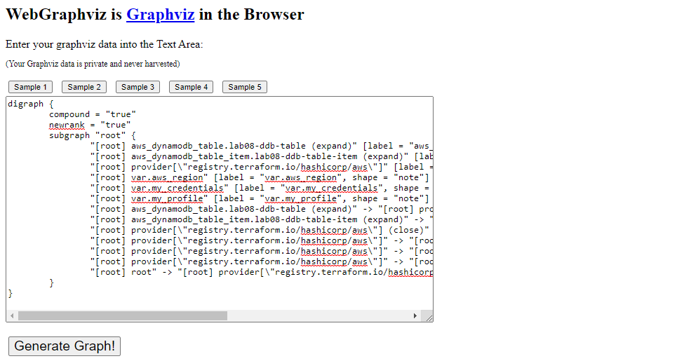

## Lab 08: Deploy DynamoDB and Solve Implicit Dependencies 

> *This lab is based on [Cloud Academy's Learning Path on "The Infrastructure Developer's Guide to Terraform: AWS Edition".](https://cloudacademy.com/learning-paths/terraform-on-aws-1-2377/)*

Before we begin, make sure you've setup the following pre-requisites

  - [Setup Keys and Permissions](../README.md#pre-requisites)
  - [Setup your Environment and Install Extensions](../README.md#pre-requisites) 
  - [Configure the Credentials File](../README.md#pre-requisites) 
  - [Install Terraform](../README.md#pre-requisites) 

### Introduction

In this lab, we'll be doing the following:

- deploying a DynamoDB database
- understand Terraform's behavior when deploying resources in order
- intentionally cause a dependency issue
- visualize a Terraform configuration file
- resolve the dependency issue

Start with creating the project directory.

```bash
$ mkdir lab07_Install_Terraform_on_Windows_Server
$ cd lab07_Install_Terraform_on_Windows_Server
```

We'll also create the core configuration files which we will populate in the succeeding steps.

```bash
$ touch main.tf 
$ touch provider.tf
$ touch vars.tf
$ touch terraform.tfvars
```

### Create the Provider file

<details><summary> provider.tf </summary>
 
```bash
terraform {
  required_version = ">= 0.12"

  required_providers {
    aws = {
      source  = "hashicorp/aws"
      version = ">= 4.16.0"
    }
  }
}

provider "aws" {
  region                   = var.aws_region
  shared_credentials_files = var.my_credentials
  profile                  = var.my_profile
}
```
 
</details>

### Create the Variable files 

<details><summary> vars.tf </summary>
 
```bash
# Variables for setting up terraform

variable "aws_region" {
  description = "AWS region"
  type        = string
}

variable "my_credentials" {
  description = "Credentials to be used to connect to AWS"
  type        = list(string)
}

variable "my_profile" {
  description = "Profile to be used to connect to AWS"
  type        = string
}
```
 
</details>

<details><summary> terraform.tfvars </summary>
 
```bash
# Variables for setting up terraform
aws_region     = "ap-southeast-1"
my_credentials = ["/mnt/c/Users/Eden.Jose/.aws/credentials"]
my_profile     = "vscode-dev"
```
 
</details>

### Create the Main file 

<details><summary> main.tf </summary>
 
```bash
# lab08 - Deploy a DynamoDB and a table item.
#----------------------------------------------------

resource "aws_dynamodb_table_item" "lab08-ddb-table-item" {
  table_name = "lab08-ddb-table-item"
  hash_key   = "ddbHashKey"

  item = <<ITEM
{
  "ddbHashKey": {"S": "StartTheCountdown"},
  "four": {"N": "44444"},
  "three": {"N": "33333"},
  "two": {"N": "22222"},
  "one": {"N": "11111"}
}
ITEM
}

resource "aws_dynamodb_table" "lab08-ddb-table" {
  name           = "lab08-ddb-table"
  hash_key       = "ddbHashKey"
  read_capacity  = 10
  write_capacity = 10

  attribute {
    name = "ddbHashKey"
    type = "S"
  }
}
```
 
</details>

### Time to Apply!

But first, initialize the working directory.

```bash
$ terraform init 
```

Verify if the config files are correctly formatted and syntactically valid.

```bash
$ terraform fmt 
$ terraform validate 
```

Next, do a dry-run of the changes before actually applying them.

```bash
$ terraform plan  
```

If it doesn't return an error, run the changes.

```bash
$ terraform apply -auto-approve 
```

Notice that when we try to provision the resources, it now returns a **ResourceNotFoundException** error message.

```bash
│ Error: ResourceNotFoundException: Requested resource not found
│
│   with aws_dynamodb_table_item.lab08-ddb-table-item,
│   on main.tf line 4, in resource "aws_dynamodb_table_item" "lab08-ddb-table-item":
│    4: resource "aws_dynamodb_table_item" "lab08-ddb-table-item" { 
```

### Understanding the Error

Doing a quick Google search, we found what's causing the [ResourceNotFoundException error:](https://stackoverflow.com/questions/40192304/aws-dynamodb-resource-not-found-exception)

> *From the docs it's either you don't have a Table with that name or it is in CREATING status.*
>
> *I would double check to verify that the table does in fact exist, in the correct region, and you're using an access key that can reach it*

This error actually means that the client cannot reach a table in your database. Here's a list of things to look into:

```bash
1. Your database is running
2. Your accessKey and secretKey are valid for the database
3. Your DB endpoint is valid and contains correct protocol ("http://" or "https://"), and correct hostname, and correct port
4. Your table was created in the database.
5. Your table was created in the database in the same region that you set as a parameter in credentials. Optional, because some
database environments (e.g. Testcontainers Dynalite) don't have an incorrect value for the region. And any nonempty region value will be correct 
```

### Visualize the Config file

To troubleshoot the issue, we can use the **terraform graph** command to visualize the configuration file. It will return a DOT-formatted "digraph" output which we can run through an online Graphviz tool. Copy the output.

```bash
$ terraform graph
```
```bash
digraph {
        compound = "true"
        newrank = "true"
        subgraph "root" {
                "[root] aws_dynamodb_table.lab08-ddb-table (expand)" [label = "aws_dynamodb_table.lab08-ddb-table", shape = "box"]
                "[root] aws_dynamodb_table_item.lab08-ddb-table-item (expand)" [label = "aws_dynamodb_table_item.lab08-ddb-table-item", shape = "box"]
                "[root] provider[\"registry.terraform.io/hashicorp/aws\"]" [label = "provider[\"registry.terraform.io/hashicorp/aws\"]", shape = "diamond"]
                "[root] var.aws_region" [label = "var.aws_region", shape = "note"]
                "[root] var.my_credentials" [label = "var.my_credentials", shape = "note"]
                "[root] var.my_profile" [label = "var.my_profile", shape = "note"]
                "[root] aws_dynamodb_table.lab08-ddb-table (expand)" -> "[root] provider[\"registry.terraform.io/hashicorp/aws\"]"
                "[root] aws_dynamodb_table_item.lab08-ddb-table-item (expand)" -> "[root] provider[\"registry.terraform.io/hashicorp/aws\"]"
                "[root] provider[\"registry.terraform.io/hashicorp/aws\"] (close)" -> "[root] aws_dynamodb_table.lab08-ddb-table (expand)"
                "[root] provider[\"registry.terraform.io/hashicorp/aws\"] (close)" -> "[root] aws_dynamodb_table_item.lab08-ddb-table-item (expand)"
                "[root] provider[\"registry.terraform.io/hashicorp/aws\"]" -> "[root] var.aws_region"
                "[root] provider[\"registry.terraform.io/hashicorp/aws\"]" -> "[root] var.my_credentials"
                "[root] provider[\"registry.terraform.io/hashicorp/aws\"]" -> "[root] var.my_profile"
                "[root] root" -> "[root] provider[\"registry.terraform.io/hashicorp/aws\"] (close)"
        }
}
```

Open [WebGraphviz](http://www.webgraphviz.com/) in your web browser, paste the copied output to the field, and run **Generate graph**. From here we can see that table and table item are being deployed at the same time. 

  

This is what's causing the error because the table has to exist first before the table item can be created. 

### Now that we know what the error means

Time to resolve the dependency issue. Under the **aws_dynamodb_table_item** resource block, we can see that it reference **table_name** and **hash_key** from the **aws_dynamodb_table** resource block.

We can use interpolation on these two fields to tell the table item to pull these two values from the **aws_dynamodb_table** resource, which means the first block must wait for the second block to finish. 

```bash
table_name = aws_dynamodb_table.lab08-ddb-table.name
hash_key   = aws_dynamodb_table.lab08-ddb-table.hash_key 
```

Our new main.tf should now look like this. 

<details><summary> main.tf </summary>
 
```bash
# lab08 - Deploy a DynamoDB and a table item.
#----------------------------------------------------

resource "aws_dynamodb_table_item" "lab08-ddb-table-item" {
  table_name = aws_dynamodb_table.lab08-ddb-table.name
  hash_key   = aws_dynamodb_table.lab08-ddb-table.hash_key

  item = <<ITEM
{
  "ddbHashKey": {"S": "StartTheCountdown"},
  "four": {"N": "44444"},
  "three": {"N": "33333"},
  "two": {"N": "22222"},
  "one": {"N": "11111"}
}
ITEM
}

resource "aws_dynamodb_table" "lab08-ddb-table" {
  name           = "lab08-ddb-table"
  hash_key       = "ddbHashKey"
  read_capacity  = 10
  write_capacity = 10

  attribute {
    name = "ddbHashKey"
    type = "S"
  }
}
```
 
</details>
</br>

Apply the changes again. It should now succeed.

```bash
$ terraform apply -auto-approve 
```
```bash
Apply complete! Resources: 1 added, 0 changed, 0 destroyed. 
```

Let's run the **graph** command again and use the output in the online [WebGraphviz](http://www.webgraphviz.com/)

```bash
$ terraform graph

digraph {
        compound = "true"
        newrank = "true"
        subgraph "root" {
                "[root] aws_dynamodb_table.lab08-ddb-table (expand)" [label = "aws_dynamodb_table.lab08-ddb-table", shape = "box"]
                "[root] aws_dynamodb_table_item.lab08-ddb-table-item (expand)" [label = "aws_dynamodb_table_item.lab08-ddb-table-item", shape = "box"]
                "[root] provider[\"registry.terraform.io/hashicorp/aws\"]" [label = "provider[\"registry.terraform.io/hashicorp/aws\"]", shape = "diamond"]
                "[root] var.aws_region" [label = "var.aws_region", shape = "note"]
                "[root] var.my_credentials" [label = "var.my_credentials", shape = "note"]
                "[root] var.my_profile" [label = "var.my_profile", shape = "note"]
                "[root] aws_dynamodb_table.lab08-ddb-table (expand)" -> "[root] provider[\"registry.terraform.io/hashicorp/aws\"]"
                "[root] aws_dynamodb_table_item.lab08-ddb-table-item (expand)" -> "[root] aws_dynamodb_table.lab08-ddb-table (expand)"
                "[root] provider[\"registry.terraform.io/hashicorp/aws\"] (close)" -> "[root] aws_dynamodb_table_item.lab08-ddb-table-item (expand)"
                "[root] provider[\"registry.terraform.io/hashicorp/aws\"]" -> "[root] var.aws_region"
                "[root] provider[\"registry.terraform.io/hashicorp/aws\"]" -> "[root] var.my_credentials"
                "[root] provider[\"registry.terraform.io/hashicorp/aws\"]" -> "[root] var.my_profile"
                "[root] root" -> "[root] provider[\"registry.terraform.io/hashicorp/aws\"] (close)"
        }
```

  

The new graph should now display the flowchart which shows that implicit dependency is created between the table and table item.

  


### Cleanup

To delete all the resources, just run the **destroy** command.

```bash
$ terraform destroy -auto-approve 
```