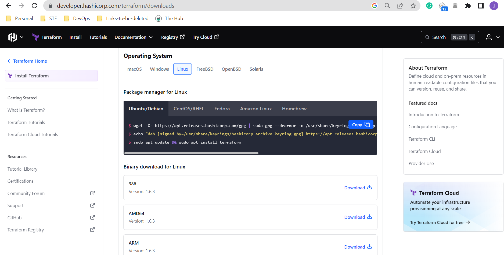

# Install Terraform on WSL 

To install Terraform locally (assuming you're running WSL on a Windows computer), follow the steps below.

Run an update first.

```bash
sudo apt-get update 
sudo apt-get upgrade  
```

Navigate to the Terraform download page and scroll down to **Binary download for Linux**. Choose the version you need and click **Download**



In WSL, go to the directory where the zip file was downloaded. 
Unzip the file and move to /usr/local/bin. Remove the zip file afterwards.

```bash
sudo mv terraform /usr/local/bin; 
rm terraform*.zip; 
```

Verify installation.

```bash
$ terraform -version
Terraform v1.6.3
on linux_386 
```

Reference: https://techcommunity.microsoft.com/t5/azure-developer-community-blog/configuring-terraform-on-windows-10-linux-sub-system/ba-p/393845